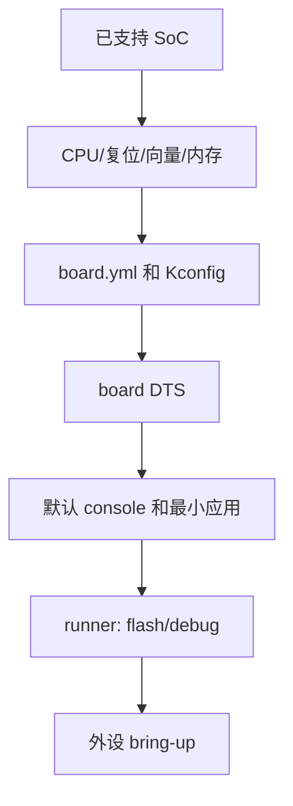
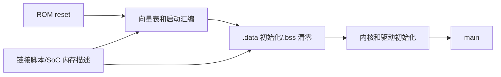

把新板带进 Zephyr 不等于复制一个 DTS。SoC 支持拥有 CPU 架构、复位启动、向量表、内存、时钟、NVIC 和片上外设；board 支持只描述“这块 PCB 使用哪个已支持 SoC、外设接在哪些引脚、默认控制台和烧录方式”。若 SoC 尚未被支持，本章的 board 文件不能替你实现启动代码。

Zephyr 4.4 使用 hardware model v2。其术语、文件命名和新建板 `full_name` 要求应以 [Board Porting Guide](https://docs.zephyrproject.org/4.4.0/hardware/porting/board_porting.html) 与 [4.4 migration guide](https://docs.zephyrproject.org/4.4.0/releases/migration-guide-4.4.html) 为准；不要照抄 3.6 以前的教程。

## 一、硬件层级决定修改位置

架构层负责 ABI、异常模型与上下文切换；SoC 层负责复位入口、内存区域、NVIC、时钟和片上控制器；board 层只把一个已支持 SoC 放到具体 PCB 上，并描述 LED、连接器、console、外设连线和调试下载方式。hardware model v2 用 board name、可选 revision 和 qualifiers 组合成 target，目的是让这种层级显式，而不是让同一个 DTS 同时承担芯片支持和产品接线。

启动链也应按所有权阅读：ROM/调试器先给 CPU 一个复位状态，架构启动代码建立向量与 C 运行时，链接布局决定 `.text`/`.data`/`.bss` 实际落点，内核按 init level 运行设备初始化，最后 main 才能请求 device API。任何“串口没输出”都不应直接归为应用故障：它可能在复位、向量、内存、时钟、pinctrl、chosen console 或 main 的任一层失败。

最小 BSP 的交付证据因此是分层的：`west boards` 证明模型发现；生成 DTS/Kconfig 证明配置闭环；ELF/map 证明链接布局；调试器 PC 和 UART/GPIO 波形证明启动到达可观测点。它们不是同一个测试，不能用一次 flash 成功替代全部证据。

## 二、先确定责任边界





对 nRF52 DK，目标为 `nrf52dk/nrf52832`，其中 `nrf52dk` 是 board name，`nrf52832` 是 qualifier/SoC。单 SoC 单核板可在用户命令中省略限定符，但板级文件名中的 `/` 会规范化为 `_`。目标的正规形式是 `board[@revision][/SoC[/CPU-cluster[/variant]]]`；`west boards` 才是本地有效名称的最终来源。

## 三、最小可用目录，而非模板拼贴

下面的 `aurora52` 是**已有 nRF52832-QFAA SoC 支持时**的下游教学板。`boards/acme` 是下游目录，可以按项目调整；向上游提交时 vendor 前缀必须已注册。这个板只有 UART console 与一个 LED，因此不能被称作外设完成，I2C 在下一课加入。

```text
board_porting_lab/
├── boards/
│   └── acme/aurora52/
│       ├── board.yml
│       ├── Kconfig.aurora52
│       ├── Kconfig.defconfig
│       ├── aurora52_nrf52832.dts
│       ├── aurora52_nrf52832_defconfig
│       ├── aurora52_nrf52832.yaml
│       └── board.cmake
└── app/
    ├── CMakeLists.txt
    ├── prj.conf
    └── src/main.c
```

`board.yml` 用于描述板和 SoC；4.4 新板必须有 `full_name`：

```yaml
board:
  name: aurora52
  full_name: Aurora 52 bring-up board
  vendor: acme
  socs:
    - name: nrf52832
```

`Kconfig.aurora52` 只选 SoC 树内相关符号，不在这里选择 shell、日志或传感器等通用应用特性：

```kconfig
config BOARD_AURORA52_NRF52832
    select SOC_NRF52832_QFAA
```

在实际树中先比较同一 Zephyr tag 下 nRF52832 板的 `Kconfig.<board>`，因为构建系统生成的 `BOARD_<normalized target>` 符号必须与文件名/target 一致；不要手写 `bool` 或提示文本。

`Kconfig.defconfig` 是可选的板级默认值，`aurora52_nrf52832_defconfig` 是该 qualifier 的片段。前者仅包含共享板选择，后者包含该板必需的控制台能力：

```kconfig
if BOARD_AURORA52_NRF52832
config UART_CONSOLE
    default y
config CONSOLE
    default y
endif
```

```ini
CONFIG_SERIAL=y
CONFIG_CONSOLE=y
CONFIG_UART_CONSOLE=y
CONFIG_GPIO=y
```

`aurora52_nrf52832.dts` 复用 SoC 的 memory、interrupt controller、GPIO/UART 定义，只覆盖 PCB 连接。这里的 P0.06/P0.08、P0.13 必须由真实原理图替换；它们不是“所有 nRF52 板”的标准接法。

```dts
#include <nordic/nrf52832_qfaa.dtsi>
#include <zephyr/dt-bindings/gpio/gpio.h>

/ {
    model = "Acme Aurora 52";
    compatible = "acme,aurora52";
    chosen {
        zephyr,console = &uart0;
        zephyr,shell-uart = &uart0;
    };
    aliases {
        led0 = &status_led;
    };
    leds {
        compatible = "gpio-leds";
        status_led: led_0 {
            gpios = <&gpio0 13 GPIO_ACTIVE_HIGH>;
            label = "Status LED";
        };
    };
};

&uart0 {
    status = "okay";
    current-speed = <115200>;
};
```

若目标 SoC 的 UART binding 要求 pinctrl，不能依赖这段简化片段，而应把 `pinctrl-0`、`pinctrl-names` 和 nRF PSEL group 放进 DTS。这正是第 24 篇的内容。编译器/DT 校验报缺少 pinctrl 是“板尚未描述完整”，不是去掉 driver Kconfig 的理由。

`aurora52_nrf52832.yaml` 描述 Twister 平台元数据，不会驱动硬件：

```yaml
identifier: aurora52/nrf52832
name: Aurora 52 bring-up board
type: mcu
arch: arm
toolchain:
  - zephyr
supported:
  - gpio
  - uart
```

`board.cmake` 只在 runner 需要显式默认值时存在。对使用 Nordic J-Link 的板，先从同 SoC、同调试探针的官方板复制并逐项核验；例如：

```cmake
board_runner_args(jlink "--device=nRF52832_xxAA")
include(${ZEPHYR_BASE}/boards/common/jlink.board.cmake)
```

`--device` 与封装必须同真实芯片和 J-Link 支持项一致。若量产板用 nRFjprog、OpenOCD 或自定义 bootloader，使用相应官方 runner 文件；不要为“能闪”直接把未知下载地址写进应用 DTS。

## 四、最小应用、命令与产物

`app/CMakeLists.txt`：

```cmake
cmake_minimum_required(VERSION 3.20.0)
find_package(Zephyr REQUIRED HINTS $ENV{ZEPHYR_BASE})
project(aurora52_bringup)
target_sources(app PRIVATE src/main.c)
```

`app/prj.conf`：

```ini
CONFIG_LOG=y
CONFIG_LOG_DEFAULT_LEVEL=3
CONFIG_MAIN_STACK_SIZE=1024
```

`app/src/main.c`：

```c
#include <errno.h>
#include <zephyr/drivers/gpio.h>
#include <zephyr/kernel.h>
#include <zephyr/logging/log.h>

LOG_MODULE_REGISTER(aurora52_bringup, LOG_LEVEL_INF);
static const struct gpio_dt_spec led = GPIO_DT_SPEC_GET(DT_ALIAS(led0), gpios);

/**
 * @brief 配置并周期翻转板级状态灯。
 * @return 0 成功；负 errno 表示 GPIO 控制器或引脚不可用。
 */
static int led_start(void)
{
    if (!gpio_is_ready_dt(&led)) {
        return -ENODEV;
    }
    return gpio_pin_configure_dt(&led, GPIO_OUTPUT_INACTIVE);
}

int main(void)
{
    int err = led_start();
    if (err != 0) {
        LOG_ERR("LED setup failed: %d", err);
        return 0;
    }
    LOG_INF("Aurora52 minimum BSP reached main");
    while (true) {
        err = gpio_pin_toggle_dt(&led);
        if (err != 0) {
            LOG_ERR("LED toggle failed: %d", err);
        }
        k_sleep(K_SECONDS(1));
    }
}
```

在应用外层执行：

```powershell
west boards --board-root board_porting_lab
west build -p always -b aurora52/nrf52832 app -- -DBOARD_ROOT=$PWD/board_porting_lab
west flash -d build
west debug -d build
```

构建成功后应存在 `build/zephyr/zephyr.elf`、`zephyr.hex`、`zephyr.bin`、`zephyr.map`、`zephyr.dts` 和 `runners.yaml`。这些是应检查的工件，非本课已经在任何硬件上取得的结果。用 `arm-zephyr-eabi-objdump -h build/zephyr/zephyr.elf` 或 toolchain 对应 objdump 检查 section；在 map 中搜索 `_vector_start`、`.text`、`.data`、`.bss`，并与 SoC 内存区域比对。

## 五、按启动顺序调试

| 现象 | 证据 | 优先恢复 |
| --- | --- | --- |
| `west boards` 无目标 | board.yml、BOARD_ROOT、文件名 | 先修目录和 yml，不构建应用 |
| Kconfig 未选 SoC | `.config`、Kconfig symbol | 对照同 SoC 板的规范化 target |
| DT 编译报节点/属性错 | `zephyr.dts` 和 binding | 修 DTS，不在 C 中硬编码引脚 |
| 能烧录、无串口 | chosen console、pinctrl、波特率、探头接地 | 先看实际 TX 波形 |
| 进不了 `main` | reset/vector/section 地址、调试器 PC | 回退到 SoC/链接层，不调 LED |
| LED 无动作 | GPIO alias、原理图极性、实测电平 | 保留 errno，核对 pin |

最小 BSP 的完成定义是：目标能被发现、能构建、runner 的连接和芯片名可核验、复位后能停在 `main`、能产生可观察的 console 或 GPIO 信号。它不等于传感器、低功耗、DFU 或无线功能已经可用。

## 六、链接、向量与调试的证据链

链接脚本通常由 architecture/SoC 层的公共脚本与内存区域描述共同生成。一个“新 board”不应复制或修改它们来迁就 PCB；只有 Flash/RAM 物理布局、启动 ROM 约束或 CPU/SoC 尚未支持时，才进入 SoC porting 范畴。MCUboot、多镜像和外部 Flash 也先从已支持 SoC 的分区机制扩展，不能从 LED 工程开始手工设定 image 地址。

| 检查点 | 看什么 | 结论边界 |
| --- | --- | --- |
| `zephyr.elf` | ELF machine、entry address、section headers | 证明链接器产生目标格式，不证明可启动 |
| `zephyr.map` | memory region、vector、text/data/bss、未解析符号 | 证明布局和空间压力，不证明引脚正确 |
| 调试器复位 | PC 是否到 reset handler、是否命中 `main` | 可区分启动层和应用层 |
| UART TX | 波特率、空闲高电平、实际字符 | 可证实 console 电气路径 |
| runner log | probe、device 名称、下载地址 | 只证实该 runner 的本次操作 |

使用 `west debug -d build` 后，在复位向量、`z_cstart`（名称可随版本/架构变化）和 `main` 分别设置断点。若第一个断点都到不了，停止分析 C 应用，转向 SWD 连接、复位脚、电源、SoC boot option 和链接/向量地址。若到达 `main` 但 console 不通，启动链大概率已完成，问题缩小到 chosen UART、pinctrl、时钟和物理接线。

发布 BSP 前还应保存“可重复输入”：Zephyr revision、west manifest revision、board 文件 hash、J-Link/OpenOCD 版本、芯片批次/封装、供电电压和串口捕获。它们不是文档装饰；缺少它们的“我这块板能启动”无法在另一台主机重现。

## 七、练习与里程碑

1. 用 `west boards --board-root` 验证名称和 qualifier，再构建 hello-world 类最小应用。
2. 用 map/ELF 标出向量表、`.text`、`.data`、`.bss` 和线程栈所属内存区。
3. 断开 LED 或改错 active polarity，证明软件日志与万用表/示波器各能说明什么。
4. 在调试器复位后逐步确认 reset handler、驱动初始化和 `main`，记录首个异常 PC。
5. 在进入下一课前，保存原理图中 UART、LED、供电与调试接口的网络名。

## 小结

板级移植的核心是按架构、SoC、board 和应用边界逐层建立证据；能构建、能下载和能运行是三件不同的事。

> 🏷️ 标签：Zephyr · BSP · 板级移植 · SoC · 启动流程 · 链接脚本 · board.yml
