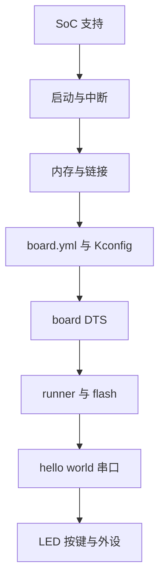
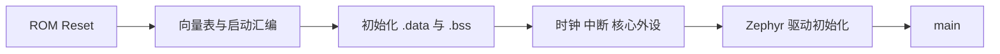

把一块新板带进 Zephyr，不是复制某个 dts 文件就结束。必须先区分 SoC 支持和 board 支持：**SoC 提供 CPU、时钟、中断、内存和外设基础；board 描述具体器件、连接器、LED、按键、Flash 与烧录方式。**

Zephyr 4.4.x 使用 hardware model v2，官方目录和必要文件见 [Board Porting Guide](https://docs.zephyrproject.org/latest/hardware/porting/board_porting.html)。

## 一、移植依赖顺序



【图1：新板支持必须从 SoC 基础逐层验证】

先选择与新 SoC 最接近的已支持参考板，逐项替换并验证。直接从应用层开始调传感器，会把启动、时钟、pinmux、串口和驱动问题混成一个故障。

## 二、最小 board 目录

```text
boards/<vendor>/my_board/
├── board.yml
├── my_board.dts
├── my_board.yaml
├── Kconfig.my_board
├── Kconfig.defconfig
├── my_board_defconfig
├── board.cmake
└── CMakeLists.txt
```

board.yml 描述 board、SoC 与 variant；DTS 描述硬件；Kconfig 文件提供与板相关的软件默认值；defconfig 选择默认驱动；board.cmake 配置 west flash/debug runner；yaml 为 Twister 提供平台元数据。新硬件模型中 board target 可能含 SoC 或 CPU qualifier，文件名会把斜杠正规化为下划线。



【图2：从复位到 main 的启动职责】

## 三、链接脚本和内存不是最后再看

链接脚本决定 Flash、RAM、堆、栈和镜像段位置。新的 SoC 或内存布局必须先让最小镜像的向量表、代码、data 拷贝和 bss 清零正确，才谈 MCUboot、OTA 和外部 Flash。每一次改动都要检查 map 文件和最终 ELF 的 section 地址。

nRF52 DK 可以验证应用侧 board overlay、runner 和构建目标，但不能替代一个新 SoC 的启动验证。新 SoC 至少需要可用的 CPU 架构支持、时钟、interrupt controller、timer 和 console，才有最小可调试环境。

## 四、动手练习

1. 复制一个同 SoC 的参考 board 目录，先只改 board 名称并运行 west boards。
2. 用最小 hello world 验证串口，再验证 LED 与按键。
3. 打开 map 文件，标出向量表、text、data、bss 和线程栈。
4. 为 board.cmake 选择一个已支持 runner，验证 west flash 与 west debug。

## 五、里程碑自检

- [ ] 能区分 SoC 支持和 board 支持
- [ ] 知道 board.yml、DTS、Kconfig、defconfig、runner 和 yaml 的职责
- [ ] 能按复位、内存、时钟、console 的顺序定位启动问题
- [ ] 会用 ELF 与 map 验证内存布局
- [ ] 不会把 nRF52 DK 的应用验证误认为新 SoC 移植完成

> 🏷️ 标签：Zephyr · BSP · 板级移植 · SoC · 启动流程 · 链接脚本 · board.yml
