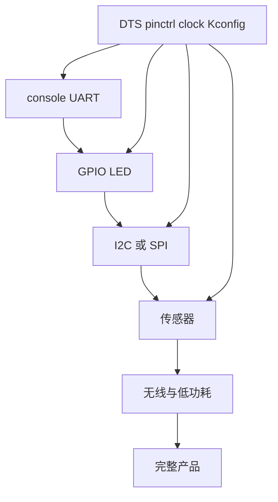
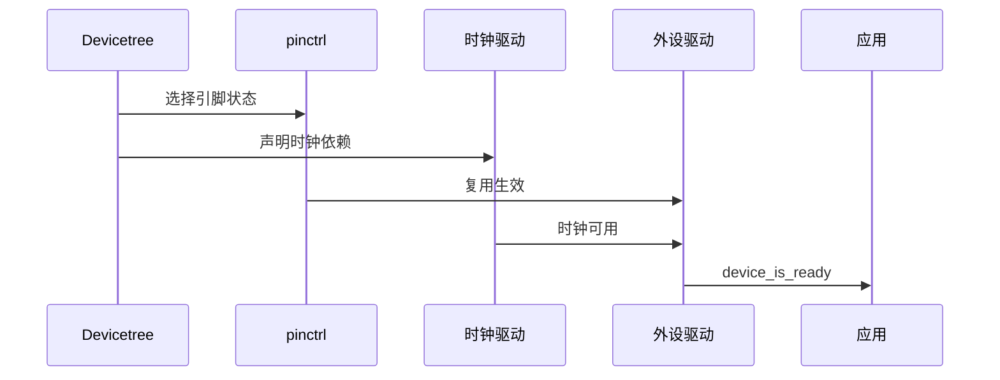

新板能启动后，最大的工作量通常来自外设适配：同一个 UART、I2C 或 SPI 控制器，换了引脚、电源域、时钟或外部器件就会表现不同。**DTS 描述连接关系，pinctrl 描述引脚状态，Kconfig 选择驱动，时钟和电源驱动保证硬件真的可用。**

## 一、不要一次启用所有外设



【图1：以可观测最小外设逐层扩展板级支持】

每加入一种外设，都要验证四件事：节点 status 是否 okay、pinctrl 是否选择正确状态、驱动 Kconfig 是否启用、物理引脚与电源是否符合原理图。

## 二、pinctrl 和时钟的角色

```dts
&pinctrl {
    i2c0_default: i2c0_default {
        group1 {
            psels = <NRF_PSEL(TWIM_SDA, 0, 26)>,
                    <NRF_PSEL(TWIM_SCL, 0, 27)>;
        };
    };
};

&i2c0 {
    status = "okay";
    pinctrl-0 = <&i2c0_default>;
    pinctrl-names = "default";
};
```

示例展示 Nordic 风格 pinctrl 表达，具体宏与属性必须以目标 SoC binding 为准。pinctrl 不是业务层配置；应用不应在运行时随意改写外设复用，除非驱动与功耗状态已经明确支持。

时钟问题常伪装成总线问题：UART 波特率异常、I2C 时序异常、PWM 周期偏差，都可能是时钟源、分频或电源域未配置。先验证 console，再用示波器验证总线时钟，最后才看协议层。



【图2：引脚、时钟和驱动初始化的依赖】

## 三、适配顺序与常见故障

| 现象 | 优先排查 |
| --- | --- |
| UART 无输出 | 复位、时钟、pinmux、console chosen 节点 |
| I2C 全部 NACK | SDA/SCL、上拉、电源、pinctrl、频率 |
| SPI 数据错位 | CPOL/CPHA、CS、时钟、DMA cache |
| PWM 无波形 | pinctrl、period、驱动状态与外设时钟 |
| device 不 ready | DTS status、Kconfig、依赖 init 失败 |

在真实新 SoC 上，把示波器、逻辑分析仪和 map 文件作为板级移植的一部分。日志只能证明软件走到了某处，不能证明引脚真的输出了正确波形。

## 四、动手练习

1. 将 nRF52 DK 的 I2C pinctrl 改到自定义引脚，验证 zephyr.dts 与波形。
2. 故意设置错误 I2C 频率，观察逻辑分析仪和驱动报错。
3. 为 UART 增加 sleep pinctrl 状态，比较休眠前后引脚状态。
4. 按 console、GPIO、I2C、传感器顺序写一份新板 bring-up 清单。

## 五、里程碑自检

- [ ] 知道 DTS、pinctrl、时钟和 Kconfig 各自负责什么
- [ ] 会按最小 console 到复杂外设的顺序 bring-up
- [ ] 能用 device_is_ready、zephyr.dts 和仪器交叉验证
- [ ] 知道时钟错误可表现为总线协议错误
- [ ] 不会在应用层硬编码 pinmux 和电源顺序

> 🏷️ 标签：Zephyr · BSP · pinctrl · clock · pinmux · I2C · SPI · 驱动适配
