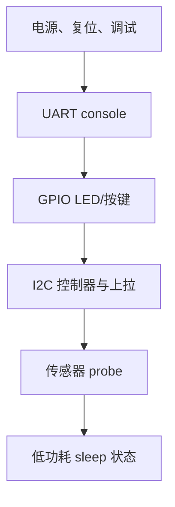
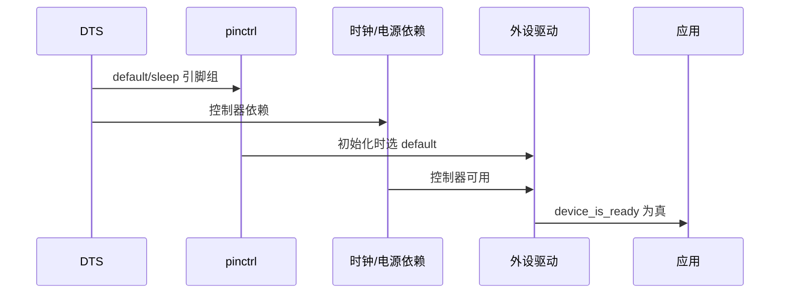

第 23 篇只让 `aurora52/nrf52832` 到达 `main()`。现在才把它变成可测外设板：先 console UART，再 GPIO，再 I2C 控制器和一个真实地址的设备。DTS 描述物理连接，pinctrl 描述某个外设的引脚状态，Kconfig 选择驱动；应用代码只通过 device API 请求服务。它们不能互相代替。

参考 [pinctrl](https://docs.zephyrproject.org/4.4.0/hardware/pinctrl/index.html)、[Devicetree how-to](https://docs.zephyrproject.org/4.4.0/build/dts/howtos.html) 和目标 SoC binding。P0.06/P0.08 UART、P0.26/P0.27 I2C 是本实验的原理图假设，必须替换为自己的网络；不要把 nRF52 DK 的接线误认为自定义板默认值。

## 一、外设可用性是一张依赖图

一个 UART/I2C 设备“ready”不是单一寄存器状态：控制器必须存在并完成 SoC init，所需时钟、复位和电源域必须可用，pinctrl default 状态必须把功能路由到正确焊盘，板外还必须满足电平、上拉、供电和器件 reset 条件。DTS 负责表达可由软件描述的依赖；驱动负责按初始化顺序解析它们；仪器负责证明 PCB 的其余部分真实存在。

default/sleep 是同一外设的两个物理引脚状态，而不是两个应用模式。default 应满足总线/console 的电气功能，sleep 应满足板级静态功耗与外部器件的约束。时钟、reset 和 regulator 节点同样应由 dependency model 管理，而不是在应用线程中直接写寄存器或加入经验性延时。

bring-up 必须一次引入一条可观察链：先用 TX 波形证明 console，再用 GPIO 电平证明 pin 及极性，再用 I2C ACK 和逻辑分析仪证明总线，最后读取从设备 ID。每一步都使下一步的失败空间变小；直接加载传感器或 BLE 会把驱动、接线、时钟和协议错误混为一个症状。


## 二、bring-up 顺序是风险隔离





时钟错误常伪装为协议错误：UART 波特率偏差、I2C 起止条件异常、PWM 周期错误都可能先出现。先测控制台 TX，再测 I2C SCL/SDA，最后才怀疑应用协议。日志证明代码走到某处，示波器和逻辑分析仪才证明引脚有正确电平与时序。

## 三、形成完整的板级外设树

目录不增加第二份“应用 overlay”；板的固定连接留在 `boards/acme/aurora52/aurora52_nrf52832.dts`，产品差异再由应用 overlay 覆盖。

```text
boards/acme/aurora52/
├── board.yml
├── Kconfig.aurora52
├── Kconfig.defconfig
├── aurora52_nrf52832.dts       # 固定硬件拓扑
├── aurora52_nrf52832_defconfig # 必需 UART/GPIO/I2C 驱动
├── aurora52_nrf52832.yaml
└── board.cmake
app/
├── CMakeLists.txt
├── prj.conf
└── src/main.c
```

将第 23 篇的 DTS 替换/扩展为下列完整核心段。对 nRF pinctrl，`pinctrl-0/1` 与 `pinctrl-names` 使驱动可选择 `default`/`sleep`；`low-power-enable` 不是业务层“关电源”，而是该 SoC pin configuration 的低功耗请求。

```dts
#include <nordic/nrf52832_qfaa.dtsi>
#include <zephyr/dt-bindings/gpio/gpio.h>

&pinctrl {
    uart0_default: uart0_default {
        group1 {
            psels = <NRF_PSEL(UART_TX, 0, 6)>,
                    <NRF_PSEL(UART_RX, 0, 8)>;
        };
    };
    uart0_sleep: uart0_sleep {
        group1 {
            psels = <NRF_PSEL(UART_TX, 0, 6)>,
                    <NRF_PSEL(UART_RX, 0, 8)>;
            low-power-enable;
        };
    };
    i2c0_default: i2c0_default {
        group1 {
            psels = <NRF_PSEL(TWIM_SDA, 0, 26)>,
                    <NRF_PSEL(TWIM_SCL, 0, 27)>;
        };
    };
    i2c0_sleep: i2c0_sleep {
        group1 {
            psels = <NRF_PSEL(TWIM_SDA, 0, 26)>,
                    <NRF_PSEL(TWIM_SCL, 0, 27)>;
            low-power-enable;
        };
    };
};

/ {
    model = "Acme Aurora 52";
    compatible = "acme,aurora52";
    chosen {
        zephyr,console = &uart0;
        zephyr,shell-uart = &uart0;
    };
    aliases {
        led0 = &status_led;
        i2c0 = &i2c0;
    };
    leds {
        compatible = "gpio-leds";
        status_led: led_0 {
            gpios = <&gpio0 13 GPIO_ACTIVE_HIGH>;
            label = "Status LED";
        };
    };
};

&uart0 {
    status = "okay";
    current-speed = <115200>;
    pinctrl-0 = <&uart0_default>;
    pinctrl-1 = <&uart0_sleep>;
    pinctrl-names = "default", "sleep";
};

&gpio0 { status = "okay"; };

&i2c0 {
    compatible = "nordic,nrf-twim";
    status = "okay";
    clock-frequency = <I2C_BITRATE_STANDARD>;
    pinctrl-0 = <&i2c0_default>;
    pinctrl-1 = <&i2c0_sleep>;
    pinctrl-names = "default", "sleep";
};
```

若具体 nRF52832 DTSI 的节点名或 compatible 已经由 SoC 层提供，保留 SoC 层值，只有覆盖 `status`、pinctrl 和频率。盲目重复 `compatible` 会掩盖 binding 不匹配。I2C 还需要硬件上拉、电平兼容和供电；DTS 不能产生这些电气条件。

`aurora52_nrf52832_defconfig` 与应用 `prj.conf` 的边界是：前者放这块板不可缺少的控制台/总线能力，后者放应用需要的日志、shell 和具体传感器。例：

```ini
# board defconfig
CONFIG_SERIAL=y
CONFIG_CONSOLE=y
CONFIG_UART_CONSOLE=y
CONFIG_GPIO=y
CONFIG_I2C=y
```

```ini
# app/prj.conf
CONFIG_LOG=y
CONFIG_LOG_DEFAULT_LEVEL=3
CONFIG_MAIN_STACK_SIZE=1536
```

## 四、分阶段 probe 应用

`CMakeLists.txt`：

```cmake
cmake_minimum_required(VERSION 3.20.0)
find_package(Zephyr REQUIRED HINTS $ENV{ZEPHYR_BASE})
project(aurora52_peripheral_probe)
target_sources(app PRIVATE src/main.c)
```

`src/main.c` 不假设 I2C 总线上一定存在设备。`i2c_write_read_dt()` 的 `struct i2c_dt_spec` 应用于已知从设备；本阶段使用 `i2c_transfer()` 发送地址探测，返回 `0` 只代表该地址 ACK，负 errno 不等于“驱动没初始化”。

```c
#include <errno.h>
#include <zephyr/drivers/gpio.h>
#include <zephyr/drivers/i2c.h>
#include <zephyr/kernel.h>
#include <zephyr/logging/log.h>

LOG_MODULE_REGISTER(aurora52_probe, LOG_LEVEL_INF);

static const struct gpio_dt_spec led = GPIO_DT_SPEC_GET(DT_ALIAS(led0), gpios);
static const struct device *const i2c_bus = DEVICE_DT_GET(DT_ALIAS(i2c0));

/**
 * @brief 探测一个 7-bit I2C 地址是否应答。
 * @param address 未移位的 7-bit 地址，范围 0x08..0x77。
 * @return 0 表示地址 ACK；负 errno 表示 NACK、总线或参数错误。
 */
static int i2c_probe(uint8_t address)
{
    if (address < 0x08U || address > 0x77U) {
        return -EINVAL;
    }
    return i2c_transfer(i2c_bus, NULL, 0, address);
}

int main(void)
{
    int err;

    if (!gpio_is_ready_dt(&led) || !device_is_ready(i2c_bus)) {
        LOG_ERR("GPIO or I2C controller not ready");
        return 0;
    }
    err = gpio_pin_configure_dt(&led, GPIO_OUTPUT_INACTIVE);
    if (err != 0) {
        LOG_ERR("LED configuration failed: %d", err);
        return 0;
    }
    LOG_INF("UART, GPIO and I2C controller ready");
    while (true) {
        err = i2c_probe(0x76);
        LOG_INF("I2C address 0x76: %s (%d)", err == 0 ? "ACK" : "no ACK", err);
        (void)gpio_pin_toggle_dt(&led);
        k_sleep(K_SECONDS(1));
    }
}
```

先不要把“扫描 0x08 到 0x77”作为产品代码：一些器件对异常访问有副作用，部分控制器对零长事务的行为也应通过 driver 文档确认。已知 BME280 地址时，0x76/0x77 的单地址 probe 是更可控的 bring-up 证据。

构建并检查生成物：

```powershell
west build -p always -b aurora52/nrf52832 app -- -DBOARD_ROOT=$PWD/board_porting_lab
Select-String build/zephyr/zephyr.dts -Pattern "uart0_default|i2c0_default|zephyr,console"
west flash -d build
```

## 五、仪器、失败模式与低功耗

| 症状 | 软件证据 | 硬件证据与恢复 |
| --- | --- | --- |
| 无 console | chosen、`uart0` status、日志不可见 | 看 TX/P0.06 波形、探头地与波特率 |
| `device_is_ready(i2c0)` 为假 | DTS status、Kconfig、init 日志 | 检查时钟/依赖，勿先换传感器 |
| 一直 NACK | controller ready 但 transfer 失败 | 确认地址、SDA/SCL 交换、上拉、电源与逻辑电平 |
| SCL 低或波形畸形 | 驱动 errno | 断电测短路，测上拉和 rise time |
| sleep 后漏电/总线锁死 | pinctrl-names、PM 流程 | 测待机电流和引脚状态，按器件手册定义 pull |
| I2C 快模式失败 | `clock-frequency` | 先降到标准模式，测时序后再提速 |

Nrf52 的外设时钟/电源细节多数由 SoC driver 管理；板 DTS 应声明它真实依赖的节点，不能在应用中直接改寄存器绕过电源管理。若板有外部传感器电源或 load switch，应为其建立 regulator/GPIO 关系，并验证驱动初始化顺序；本课不假装 nRF52832 板载这种器件。

## 六、依赖模型与低功耗审查

设备树的 `status = "okay"` 只是允许构建该节点，不承诺驱动初始化成功。`DEVICE_DT_GET()` 可在编译期取得设备对象；`device_is_ready()` 在运行期确认初始化是否完成。二者必须配合：把未 ready 的设备传给 I2C/GPIO API 会把板级失败延后为难以归因的 errno。

`chosen` 是系统用途的选择，不是硬件连接定义。`zephyr,console` 决定 console 输出去哪一个 enabled UART；`zephyr,shell-uart` 仅在启用 shell 时指定其底层。应用不应自行绕过 chosen 去“猜测 uart0”，因为另一块板可能把 console 放在 USB CDC 或另一个 UART。

外部电源域应在 DTS 中建模为 regulator 或受控 GPIO 后再让器件节点引用；不能依靠 `k_sleep(10)` 猜测上电时序。同理，I2C 上拉、电平转换、传感器 reset 和地址 strap 是原理图责任。建模无法替代电气验证，但能让驱动 init 按依赖关系排序并暴露缺失条件。

| 设计选择 | 好处 | 风险与检查 |
| --- | --- | --- |
| 固定连接放 board DTS | 所有应用继承正确拓扑 | 修改时影响全板，必须重新测 console/总线 |
| 产品选件放 app overlay | 一个 BSP 支持多个 SKU | overlay 需与 base DTS 合并后检查 |
| default/sleep pinctrl | 明确活跃与静态状态 | sleep 电平必须满足外部器件手册 |
| 应用轮询 probe | 快速教学诊断 | 不可替代正式传感器 driver/PM 策略 |
| 逻辑分析仪捕获 | 证明实际时序 | 采样率、探头负载和接地点需记录 |

在引入 PM 前，先用普通运行状态确认节点可工作；然后以一次受控 suspend/resume 验证 pinctrl sleep/default 是否真的被 driver/PM 路径使用。没有调用相应 PM API 或驱动不支持状态转换时，单纯写 `pinctrl-1` 不会自动让示波器看到状态变化。

## 七、练习与里程碑

1. 在不接 I2C 器件时记录 NACK 和 SCL/SDA 空闲电平；接入已知地址器件后记录 ACK，二者都应是可解释结果。
2. 故意交换 SDA/SCL、去掉上拉或改错地址，一次只改变一项，用逻辑分析仪定位。
3. 在 `zephyr.dts` 中确认 default/sleep PSEL，与原理图逐一核对。
4. 为 UART 和 I2C 的 sleep group 写出目标静态电平与所需外部上下拉，再用电流计/示波器验证。
5. 仅当 console、GPIO、I2C 控制器和实际从设备各有独立证据后，才加入 sensor driver。

## 小结

外设 bring-up 不是批量把节点改成 okay，而是沿供电、时钟、pinctrl、控制器和从设备依赖逐级验证，并为 active/sleep 状态都保留仪器证据。

> 🏷️ 标签：Zephyr · BSP · pinctrl · clock · pinmux · I2C · SPI · 驱动适配
