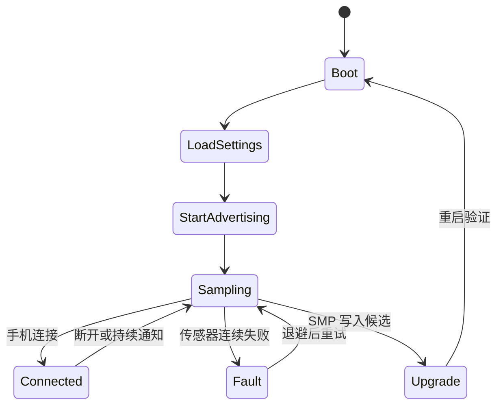

综合项目的目标不是把所有子系统堆进 main.c，而是让每个模块都有清楚输入、输出和故障边界。节点定期采样 BME280，通过 BLE GATT 向手机提供读和通知，保存采样配置，并预留 MCUboot DFU 能力。

## 一、模块边界


【图1：环境监测节点的模块关系】

推荐目录：

```text
env_node/
├── src/main.c
├── src/sampling.c
├── src/gatt_service.c
├── src/settings_store.c
├── prj.conf
├── app.overlay
└── sysbuild.conf
```

main 只初始化子系统和启动调度；sampling 拥有传感器、定时器和工作项；gatt_service 拥有 UUID 与属性；settings_store 验证并保存配置。这样 BLE 断开、传感器失败或升级候选启动都不会让业务逻辑互相缠绕。

## 二、运行状态机



【图2：节点从启动、采样到升级的状态】

最低配置应按功能分组，避免复制样例里无关的选项：

```ini
CONFIG_BT=y
CONFIG_BT_PERIPHERAL=y
CONFIG_BT_SMP=y
CONFIG_I2C=y
CONFIG_SENSOR=y
CONFIG_BME280=y
CONFIG_SETTINGS=y
CONFIG_SETTINGS_NVS=y
CONFIG_LOG=y
CONFIG_PM=y
```

## 三、端到端验收

| 场景 | 预期结果 |
| --- | --- |
| 首次启动 | 设备广播，手机发现自定义服务 |
| 手机订阅 | 每个采样周期收到格式正确的快照 |
| 修改采样周期 | 参数验证后写入 settings，重启仍保留 |
| 传感器断线 | 记录失败并退避，BLE 不崩溃 |
| 断开重连 | 重新广播，客户端可重新订阅 |
| OTA 测试镜像 | 自检成功才确认，否则重启回滚 |

采样频率、通知频率、连接参数、日志等级和栈大小都要成为可配置、可测量的产品参数。nRF52832 的 64 KB RAM 要为 BLE、工作队列、日志和升级缓冲留预算，不能只在单个功能样例上判断“够用”。

## 四、动手练习

1. 用 settings 保存采样间隔，并从手机写特征修改它。
2. 为传感器连续失败增加退避与状态特征。
3. 用 nRF Connect 完成发现、读取、订阅、改配置和重连。
4. 构建带 MCUboot 的版本，执行一次测试升级与回滚演练。

## 五、里程碑自检

- [ ] 已将采样、GATT、settings 和升级拆成独立模块
- [ ] 每个手机可见数据都有单位、格式和更新策略
- [ ] 传感器失败不会阻塞无线和升级路径
- [ ] 配置在重启后可验证恢复
- [ ] 已完成一次真实或模拟的 DFU 回滚演练

## 小结

产品雏形的价值在于让前面的机制同时工作：设备树绑定硬件，工作队列隔离采样，GATT 交付数据，settings 保存策略，MCUboot 守住升级。边界清楚，功能才可以持续增加。

> 🏷️ 标签：Zephyr · BLE · BME280 · GATT · settings · MCUboot · 环境监测 · 综合项目
