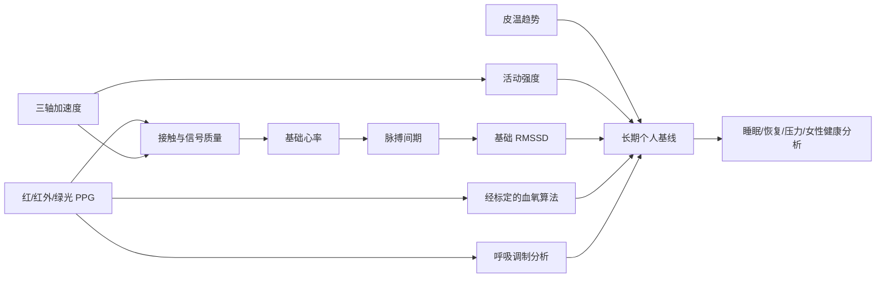
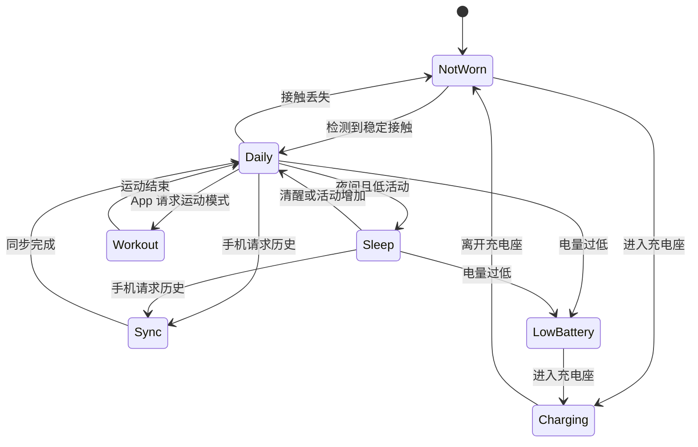
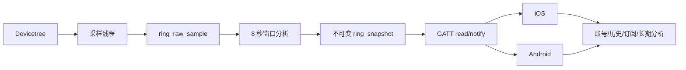

## 一、项目介绍：我们要做一枚怎样的智能戒指

这一篇要完成的项目，是一枚面向日常健康管理的智能戒指原型。用户戴上戒指后，设备采集手指上的光学容积脉搏波、皮肤接触温度和三轴运动数据；固件判断戒指是否佩戴、评估当前信号是否可信，计算教学级心率与心率变异性结果，再通过 BLE 同步给 iOS 或 Android 手机。

从用户视角看，它没有屏幕，也不要求手机一直连接。戒指负责采集、质量控制和初步处理，手机负责展示趋势、管理账号和同步云端。睡眠、活动、压力、心脏健康、女性健康等长期分析，以及会员订阅提供的高级报告，属于移动端与云端产品层，而不是戒指内部几十个彼此独立的传感器功能。

本项目完成以下闭环：

1. MAX30101 采集绿光、红光和红外光 PPG 原始值；
2. LIS2DW12 采集三轴加速度，用于活动检测和运动伪影判断；
3. TMP117 采集手指接触位置的温度趋势；
4. nRF52832 对 8 秒窗口进行佩戴检测、质量评估和基础脉搏分析；
5. 自定义 GATT 服务把 19 字节二进制快照同步到手机；
6. BLE 链路要求加密，断开后自动恢复广播；
7. 用状态机和功耗预算说明怎样从开发板原型走向 5～8 天续航产品。

这里必须先声明边界：这是**消费级健康管理教学原型，不是医疗器械**。代码实现原始信号链路、佩戴判断、信号质量、活动量、基础心率和基础 RMSSD；血氧、呼吸率、睡眠分期、压力与疾病风险需要经过标定的算法、足够长的数据窗口、人体对照实验和法规评估。本文不会用一个未经标定的公式伪造这些结论。

系列主线硬件仍是 Zephyr 4.4.x 的 `nrf52dk/nrf52832`。开发板便于接线、日志和调试，但不代表戒指的量产形态。真正戴在手上的产品还需要定制弧形 PCB、小型电池、充电管理、光学遮光结构、天线匹配、防水外壳和人体工学验证。

## 二、市场参考：热销智能戒指的共同架构

不同品牌宣传的健康指标很多，但底层硬件高度相似：

| 市场方案 | 官方公开的核心传感器 | 公开的产品特征 | 对本项目的启发 |
| --- | --- | --- | --- |
| [Oura Ring 4](https://support.ouraring.com/hc/en-us/articles/33045011508115-Oura-Ring-4) | 红/红外/绿光 PPG、数字温度、加速度 | 睡眠和恢复分析；官方给出典型 5～8 天续航 | 多波长光学 + 温度 + 运动是核心组合 |
| [Samsung Galaxy Ring](https://www.samsung.com/us/support/answer/ANS10003278/) | 光学心率、皮温、加速度 | 与手机生态协同；官方报告列出 Zephyr RTOS | 戒指固件必须与移动平台共同设计 |
| [RingConn Gen 2](https://ringconn.com/products/ringconn-gen-2) | PPG、温度、三轴加速度 | 睡眠、活动和生命体征趋势 | 长时佩戴要求离线记录和低功耗 |
| [Ultrahuman Ring AIR](https://www.ultrahuman.com/sx/ring/buy/) | 红外 PPG、温度、六轴运动 | 代谢、恢复和活动分析 | 指标数量来自算法组合，不等于传感器数量 |

用户提供的市场描述提到“超过 50 项健康指标”。这不意味着戒指里有 50 个传感器，更准确的分层如下：

| 层级 | 例子 | 产生位置 |
| --- | --- | --- |
| 直接观测量 | 红/红外/绿光反射强度、三轴加速度、接触温度 | 传感器和驱动 |
| 设备侧特征 | 是否佩戴、信号质量、活动强度、脉搏间期、基础心率 | 戒指固件 |
| 长期健康指标 | 睡眠阶段、恢复、压力、呼吸率趋势、周期趋势 | 手机或云端算法 |
| 产品服务 | 个性化报告、历史对比、会员订阅、跨平台账号 | App 和云服务 |

这样拆分不是为了降低目标，而是为了保证数据可信。固件首先要保证时间轴一致、单位明确、失效可见；如果运动时的原始信号已经失真，后面的“智能分析”只会把噪声包装成漂亮数字。

## 三、三个传感器怎样变成健康指标

### 3.1 PPG 测到的是反射光，不是心率数字

PPG（Photoplethysmography，光电容积脉搏波）由 LED 和光电二极管组成。LED 向皮肤发光，血液容积随心搏变化，返回光强也随之变化。接收信号通常包含两部分：

- **DC 分量**：组织、静脉血、佩戴压力和环境光形成的慢变化基线；
- **AC 分量**：动脉血容积随每次心搏产生的较小波动。

绿光适合寻找较清晰的脉搏峰值；红光与红外光的 AC/DC 比值可以作为血氧算法输入。但“芯片有红光和红外光”不等于“读两个寄存器就得到可靠 SpO2”。LED 电流、光路、肤色、手指压力、环境光、运动伪影和器件差异都会改变结果，最终换算曲线必须针对硬件进行标定，并与参考仪器做人体对照。

因此，本文采集 MAX30101 的红、红外和绿光原始值，但默认把 BLE 快照中的血氧字段设为 `0xFF`，表示“当前算法未提供有效结果”。这比输出一个看似正常却无法追溯的 `98%` 更符合工程要求。

### 3.2 皮温是接触位置趋势，不是核心体温

TMP117 测到的是传感器封装附近温度。它会受到室温、戒指松紧、手指血流、刚摘戴和传感器自热影响。单次读数不能直接解释为核心体温；更有价值的是在相似佩戴条件下观察夜间基线和相对变化。

固件用 `0.01 °C` 的有符号整数传输温度，避免在 BLE 包中发送浮点文本。移动端再结合佩戴状态、时间段和个人基线生成趋势。

### 3.3 加速度既描述活动，也保护 PPG 结果

LIS2DW12 的三轴数据有两个用途：一是估计活动强度，二是识别 PPG 运动伪影。手指快速运动时，戒指与皮肤的相对位置会变化，PPG 波形中的峰不一定来自心搏。如果只看光学信号，算法很容易把敲桌子或跑步节奏算成心率。

本项目为每个采样点计算加速度模长与 `1 g` 的偏差，并在 8 秒窗口内求平均得到 `activity_mg`。活动过强时降低信号质量，心率结果随之失效。这里的 `mg` 是千分之一重力加速度，不是质量单位毫克。

### 3.4 指标依赖关系



心率可以在短窗口中快速估计；睡眠分期和周期趋势需要数小时到数周历史，更适合手机或云端。会员订阅也只控制 App/云端服务权益，不应该阻止用户读取戒指基础数据或进行安全升级。

## 四、硬件与佩戴结构设计

### 4.1 教学原型 BOM

| 模块 | 参考器件 | 作用 | I2C 地址 |
| --- | --- | --- | --- |
| 主控与 BLE | nRF52 DK / nRF52832 | Zephyr、计算、存储、BLE | - |
| 光学 PPG | MAX30101 模块 | 红/红外/绿光原始数据 | `0x57` |
| 加速度 | LIS2DW12 模块 | 活动和运动伪影 | `0x19`，部分模块为 `0x18` |
| 接触温度 | TMP117 模块 | 皮肤接触温度趋势 | `0x48` |
| 电量计（量产可选） | MAX17048 | 电压和荷电状态估计 | `0x36` |

MAX30101 裸芯片的核心电源、I/O 电源和 LED 电源要求不能简单等同为 3.3 V。教学时应选择已经处理好供电、电平和上拉的模块，并核对模块原理图；量产板必须重新按数据手册设计。

### 4.2 光学结构先决定信号上限

PPG 模块应位于手指掌侧，LED 与光电二极管周围需要不透光隔墙或黑色软胶圈，避免 LED 光直接串入接收端。戒指过松会产生相对运动，过紧又会改变局部血流。温度传感器要靠近内圈导热区域，同时远离 MCU、充电芯片等热源。

开发阶段至少记录戒指尺寸、传感器朝向、接触压力和遮光材料。否则同一套阈值在不同外壳中不会保持一致。

### 4.3 5～8 天续航对应的电流预算

假设量产戒指使用 `18～25 mAh` 小电池，并保留 20% 容量余量：

```text
18 mAh × 80% ÷ (8 × 24 h) ≈ 75 µA
25 mAh × 80% ÷ (5 × 24 h) ≈ 167 µA
```

也就是说，5～8 天续航对应的大致平均电流预算只有 `75～167 µA`。PPG LED 通常是主要负载，不能让三种 LED、CPU 和 BLE 长时间以最高速率工作。开发板上的调试器、稳压器和指示灯也会显著增加电流，所以不能拿 nRF52 DK 的整板电流直接宣称戒指续航。

合理的产品状态机如下：



| 状态 | PPG 策略 | 加速度/温度 | BLE 策略 |
| --- | --- | --- | --- |
| `NotWorn` | 周期短探测或关闭 | 低频唤醒检测 | 慢速广播 |
| `Daily` | 间歇窗口或自适应采样 | 12.5～25 Hz；温度低频 | 平时断开，需要时同步 |
| `Sleep` | 较连续的低噪声采样 | 低频运动 + 温度趋势 | 尽量不保持连接 |
| `Workout` | 50～100 Hz 连续采样 | 50～100 Hz | 可实时通知，功耗最高 |
| `Sync` | 保持必要采样 | 上传摘要或历史 | 批量传输后断开 |
| `LowBattery` | 关闭高耗能光路 | 只保留关键检测 | 低频广播告警 |

下面的开发板代码固定 50 Hz 轮询，是为了先验证完整数据链。它是功能基线，不是 5～8 天功耗配置。正确性通过后，应改为 MAX30101 FIFO/中断、LIS2DW12 唤醒中断和按状态切换采样率。

## 五、软件架构与数据所有权



数据所有权必须明确：

- 采样线程独占三个传感器的 `sensor_sample_fetch()` / `sensor_channel_get()` 时序；
- 窗口分析只处理固定单位的原始样本，不访问 I2C，也不知道 BLE；
- GATT 只编码不可变快照、管理 CCC 和连接状态，不在 ATT 回调中采样；
- `main()` 只负责初始化顺序和启动门控；
- App/云端处理跨小时或跨天的个性化模型，不反向篡改原始测量事实。

每个字段还要有明确无效状态：

| 字段 | 单位/编码 | 无效表达 |
| --- | --- | --- |
| PPG 红/红外/绿光 | 传感器原始计数 | `valid_mask` 未置位 |
| 加速度 | `mg` | `valid_mask` 未置位 |
| 皮温 | `0.01 °C` | `INT16_MIN` 且标志未置位 |
| 心率 | `bpm` | `0` 且 `HR_VALID` 未置位 |
| RMSSD | `ms` | `0` 且 `HRV_VALID` 未置位 |
| SpO2 | `%` | `0xFF` 且 `SPO2_VALID` 未置位 |
| 质量 | `0～100` | `0` |

“值为零”和“没有有效结果”不能混为一谈。静止时活动量可能确实为零，未佩戴时心率为零却只能解释为无效。

## 六、完整工程配置

项目保持最小结构，完整逻辑放在一个 `main.c` 中，便于读者先复现闭环；量产时再按采样、算法、存储、BLE 和电源状态拆分模块。

```text
smart_ring/
├── CMakeLists.txt
├── prj.conf
├── app.overlay
└── src/
    └── main.c
```

`CMakeLists.txt`：

```cmake
cmake_minimum_required(VERSION 3.20.0)
find_package(Zephyr REQUIRED HINTS $ENV{ZEPHYR_BASE})
project(smart_ring)

target_sources(app PRIVATE src/main.c)
```

`prj.conf`：

```ini
# 日志与线程
CONFIG_LOG=y
CONFIG_LOG_DEFAULT_LEVEL=3
CONFIG_MAIN_STACK_SIZE=2048
CONFIG_THREAD_NAME=y

# I2C 与传感器驱动
CONFIG_I2C=y
CONFIG_SENSOR=y
CONFIG_MAX30101=y
CONFIG_LIS2DW12=y
CONFIG_TMP11X=y

# BLE 外设、配对和加密 GATT
CONFIG_BT=y
CONFIG_BT_PERIPHERAL=y
CONFIG_BT_SMP=y
CONFIG_BT_DEVICE_NAME="Zephyr Smart Ring"
CONFIG_BT_MAX_CONN=1
CONFIG_BT_MAX_PAIRED=2
CONFIG_BT_GATT_DYNAMIC_DB=n

# 保存 BLE bond
CONFIG_FLASH=y
CONFIG_FLASH_MAP=y
CONFIG_NVS=y
CONFIG_SETTINGS=y
CONFIG_SETTINGS_NVS=y
CONFIG_BT_SETTINGS=y
```

`app.overlay` 把三个模块挂到 nRF52 DK 的 `i2c0`。P0.26 为 SDA，P0.27 为 SCL；模块必须共地，并避免多块开发模块的上拉电阻并联后阻值过低。

```dts
#include <zephyr/dt-bindings/i2c/i2c.h>
#include <zephyr/dt-bindings/pinctrl/nrf-pinctrl.h>

&pinctrl {
    i2c0_default: i2c0_default {
        group1 {
            psels = <NRF_PSEL(TWIM_SDA, 0, 26)>,
                    <NRF_PSEL(TWIM_SCL, 0, 27)>;
        };
    };

    i2c0_sleep: i2c0_sleep {
        group1 {
            psels = <NRF_PSEL(TWIM_SDA, 0, 26)>,
                    <NRF_PSEL(TWIM_SCL, 0, 27)>;
            low-power-enable;
        };
    };
};

&i2c0 {
    status = "okay";
    pinctrl-0 = <&i2c0_default>;
    pinctrl-1 = <&i2c0_sleep>;
    pinctrl-names = "default", "sleep";
    clock-frequency = <I2C_BITRATE_FAST>;

    ppg: max30101@57 {
        compatible = "maxim,max30101";
        reg = <0x57>;
        status = "okay";
        acq-mode = "multi-led";
        led-slot = <1 2 3 0>;
        led-pa = [18 18 10];
        smp-ave = <1>;
        smp-sr = <50>;
        adc-rge = <8192>;
        led-pw = <215>;
        fifo-rollover-en;
    };

    accel: lis2dw12@19 {
        compatible = "st,lis2dw12";
        reg = <0x19>;
        status = "okay";
        range = <4>;
        odr = <50>;
        power-mode = <1>;
    };

    skin_temp: tmp117@48 {
        compatible = "ti,tmp11x";
        reg = <0x48>;
        status = "okay";
        odr = <0x280>;
        oversampling = <0x20>;
    };
};

/ {
    aliases {
        ring-ppg = &ppg;
        ring-accel = &accel;
        ring-temp = &skin_temp;
    };
};
```

`led-pa` 是 LED 脉冲幅度寄存器值，不是毫安数。示例值仅用于起步，必须根据模块、光学结构、饱和情况和电流实测调节。若 LIS2DW12 模块地址是 `0x18`，节点名和 `reg` 要同时改为 `lis2dw12@18` / `<0x18>`。

## 七、完整实现：传感、质量控制、基础指标与 BLE

下面的 `src/main.c` 可以直接放入工程。所有自定义函数都带有用途、参数和返回值注释。代码不把无效结果包装成健康数据，血氧字段在未接入标定算法时始终为 `0xFF`。

```c
#include <errno.h>
#include <limits.h>
#include <stdbool.h>
#include <stddef.h>
#include <stdint.h>
#include <string.h>

#include <zephyr/bluetooth/bluetooth.h>
#include <zephyr/bluetooth/conn.h>
#include <zephyr/bluetooth/gatt.h>
#include <zephyr/device.h>
#include <zephyr/drivers/sensor.h>
#include <zephyr/kernel.h>
#include <zephyr/logging/log.h>
#include <zephyr/settings/settings.h>
#include <zephyr/sys/atomic.h>
#include <zephyr/sys/byteorder.h>
#include <zephyr/sys/util.h>

LOG_MODULE_REGISTER(smart_ring, LOG_LEVEL_INF);

#define PPG_SAMPLE_HZ           50U
#define WINDOW_SECONDS          8U
#define WINDOW_SAMPLES          (PPG_SAMPLE_HZ * WINDOW_SECONDS)
#define SAMPLE_PERIOD_MS        (1000U / PPG_SAMPLE_HZ)
#define TEMP_SAMPLE_TICKS       (30000U / SAMPLE_PERIOD_MS)
#define SAMPLING_STACK_SIZE     2048
#define SAMPLING_PRIORITY       5

#define GREEN_DC_MIN            5000U
#define GREEN_DC_MAX            250000U
#define GREEN_AC_MIN            150U
#define QUALITY_FOR_HR          60U
#define MIN_PEAK_DISTANCE       15U
#define MAX_PEAK_DISTANCE       75U
#define MAX_TRACKED_PEAKS       32U

#define SPO2_UNAVAILABLE        UINT8_MAX
#define TEMP_UNAVAILABLE        INT16_MIN

#define VALID_PPG               BIT(0)
#define VALID_ACCEL             BIT(1)
#define VALID_TEMP              BIT(2)

#define FLAG_WORN               BIT(0)
#define FLAG_HR_VALID           BIT(1)
#define FLAG_HRV_VALID          BIT(2)
#define FLAG_TEMP_VALID         BIT(3)
#define FLAG_SPO2_VALID         BIT(4)

#define BT_UUID_RING_SERVICE_VAL \
    BT_UUID_128_ENCODE(0x7c9a0000, 0x6d31, 0x4b2f, \
                       0x8b6a, 0x4f3e2d1c1001)
#define BT_UUID_RING_SNAPSHOT_VAL \
    BT_UUID_128_ENCODE(0x7c9a0001, 0x6d31, 0x4b2f, \
                       0x8b6a, 0x4f3e2d1c1001)

enum payload_offset {
    PAYLOAD_SEQUENCE = 0,
    PAYLOAD_UPTIME = 4,
    PAYLOAD_HEART_RATE = 8,
    PAYLOAD_RMSSD = 10,
    PAYLOAD_TEMPERATURE = 12,
    PAYLOAD_ACTIVITY = 14,
    PAYLOAD_SPO2 = 16,
    PAYLOAD_QUALITY = 17,
    PAYLOAD_FLAGS = 18,
    PAYLOAD_LENGTH = 19,
};

struct ring_raw_sample {
    uint32_t ppg_red;
    uint32_t ppg_ir;
    uint32_t ppg_green;
    int16_t accel_x_mg;
    int16_t accel_y_mg;
    int16_t accel_z_mg;
    int16_t skin_temp_centi_c;
    uint8_t valid_mask;
};

struct ring_snapshot {
    uint32_t sequence;
    uint32_t uptime_s;
    uint16_t heart_rate_bpm;
    uint16_t rmssd_ms;
    int16_t skin_temp_centi_c;
    uint16_t activity_mg;
    uint8_t spo2_pct;
    uint8_t quality;
    uint8_t flags;
};

static const struct device *const ppg =
    DEVICE_DT_GET(DT_ALIAS(ring_ppg));
static const struct device *const accel =
    DEVICE_DT_GET(DT_ALIAS(ring_accel));
static const struct device *const skin_temp =
    DEVICE_DT_GET(DT_ALIAS(ring_temp));

static uint32_t green_window[WINDOW_SAMPLES];
static uint16_t motion_window[WINDOW_SAMPLES];
static size_t window_count;
static uint32_t next_sequence;
static int16_t last_temperature = TEMP_UNAVAILABLE;
static bool temperature_valid;

static struct bt_uuid_128 ring_service_uuid =
    BT_UUID_INIT_128(BT_UUID_RING_SERVICE_VAL);
static struct bt_uuid_128 ring_snapshot_uuid =
    BT_UUID_INIT_128(BT_UUID_RING_SNAPSHOT_VAL);
static uint8_t latest_payload[PAYLOAD_LENGTH];
static struct k_mutex payload_lock;
static atomic_t notify_enabled;

K_SEM_DEFINE(sampling_start, 0, 1);

/**
 * @brief 用纯整数算法计算 64 位无符号数的平方根。
 *
 * @param value 被开方数。
 * @return floor(sqrt(value))。
 */
static uint32_t integer_sqrt_u64(uint64_t value)
{
    uint64_t result = 0U;
    uint64_t bit = 1ULL << 62;

    while (bit > value) {
        bit >>= 2;
    }

    while (bit != 0U) {
        if (value >= result + bit) {
            value -= result + bit;
            result = (result >> 1) + bit;
        } else {
            result >>= 1;
        }
        bit >>= 2;
    }

    return (uint32_t)result;
}

/**
 * @brief 把 m/s² 的 sensor_value 转为 mg 并限幅。
 *
 * @param value Zephyr sensor API 返回的加速度。
 * @return 以 mg 表示的 int16_t 加速度。
 */
static int16_t acceleration_to_mg(const struct sensor_value *value)
{
    int64_t mg = sensor_value_to_micro(value) / 9807;

    return (int16_t)CLAMP(mg, INT16_MIN, INT16_MAX);
}

/**
 * @brief 把摄氏度 sensor_value 转为 0.01 °C。
 *
 * @param value Zephyr sensor API 返回的温度。
 * @return 以 0.01 °C 表示并限幅后的温度。
 */
static int16_t temperature_to_centi_c(
    const struct sensor_value *value)
{
    int64_t centi_c = sensor_value_to_micro(value) / 10000;

    return (int16_t)CLAMP(centi_c, INT16_MIN + 1, INT16_MAX);
}

/**
 * @brief 检查三个传感器是否完成 Zephyr 设备初始化。
 *
 * @return 全部就绪返回 0，否则返回 -ENODEV。
 */
static int sensor_hub_init(void)
{
    if (!device_is_ready(ppg) ||
        !device_is_ready(accel) ||
        !device_is_ready(skin_temp)) {
        return -ENODEV;
    }

    return 0;
}

/**
 * @brief 读取 PPG、加速度和可选温度，组成一个原始样本。
 *
 * @param sample 接收固定单位数据和 valid_mask 的输出结构。
 * @param read_temperature 为 true 时刷新温度，否则复用最近有效值。
 * @return 核心 PPG 与加速度成功返回 0，否则返回负错误码。
 */
static int read_sensor_sample(struct ring_raw_sample *sample,
                              bool read_temperature)
{
    struct sensor_value red;
    struct sensor_value ir;
    struct sensor_value green;
    struct sensor_value xyz[3];
    struct sensor_value temperature;
    int err;

    if (sample == NULL) {
        return -EINVAL;
    }

    memset(sample, 0, sizeof(*sample));
    sample->skin_temp_centi_c = TEMP_UNAVAILABLE;

    err = sensor_sample_fetch(ppg);
    if (err == 0) {
        err = sensor_channel_get(ppg, SENSOR_CHAN_RED, &red);
    }
    if (err == 0) {
        err = sensor_channel_get(ppg, SENSOR_CHAN_IR, &ir);
    }
    if (err == 0) {
        err = sensor_channel_get(ppg, SENSOR_CHAN_GREEN, &green);
    }
    if (err != 0) {
        return err;
    }

    sample->ppg_red = (uint32_t)MAX(red.val1, 0);
    sample->ppg_ir = (uint32_t)MAX(ir.val1, 0);
    sample->ppg_green = (uint32_t)MAX(green.val1, 0);
    sample->valid_mask |= VALID_PPG;

    err = sensor_sample_fetch(accel);
    if (err == 0) {
        err = sensor_channel_get(
            accel, SENSOR_CHAN_ACCEL_XYZ, xyz);
    }
    if (err != 0) {
        return err;
    }

    sample->accel_x_mg = acceleration_to_mg(&xyz[0]);
    sample->accel_y_mg = acceleration_to_mg(&xyz[1]);
    sample->accel_z_mg = acceleration_to_mg(&xyz[2]);
    sample->valid_mask |= VALID_ACCEL;

    if (read_temperature) {
        err = sensor_sample_fetch(skin_temp);
        if (err == 0) {
            err = sensor_channel_get(
                skin_temp, SENSOR_CHAN_AMBIENT_TEMP,
                &temperature);
        }
        if (err == 0) {
            last_temperature =
                temperature_to_centi_c(&temperature);
            temperature_valid = true;
        }
    }

    if (temperature_valid) {
        sample->skin_temp_centi_c = last_temperature;
        sample->valid_mask |= VALID_TEMP;
    }

    return 0;
}

/**
 * @brief 计算加速度模长相对 1 g 的偏差。
 *
 * @param sample 含三轴 mg 数据的原始样本。
 * @return 以 mg 表示并限幅后的瞬时活动量。
 */
static uint16_t motion_from_acceleration(
    const struct ring_raw_sample *sample)
{
    int64_t x = sample->accel_x_mg;
    int64_t y = sample->accel_y_mg;
    int64_t z = sample->accel_z_mg;
    uint32_t magnitude = integer_sqrt_u64(
        (uint64_t)(x * x + y * y + z * z));
    uint32_t deviation = magnitude > 1000U
        ? magnitude - 1000U : 1000U - magnitude;

    return (uint16_t)MIN(deviation, UINT16_MAX);
}

/**
 * @brief 根据绿光基线、脉动幅度和运动量生成质量分数。
 *
 * @param mean_green 绿光原始值平均数。
 * @param range_green 绿光最大值与最小值之差。
 * @param activity_mg 窗口平均活动量。
 * @return 0 表示不可用，100 表示当前规则下质量最好。
 */
static uint8_t calculate_quality(uint32_t mean_green,
                                 uint32_t range_green,
                                 uint16_t activity_mg)
{
    uint32_t penalty;

    if (mean_green < GREEN_DC_MIN ||
        mean_green > GREEN_DC_MAX ||
        range_green < GREEN_AC_MIN) {
        return 0U;
    }

    penalty = MIN((uint32_t)activity_mg / 4U, 70U);
    if (range_green < GREEN_AC_MIN * 2U) {
        penalty += 20U;
    }

    return (uint8_t)(100U - MIN(penalty, 100U));
}

/**
 * @brief 从绿光局部峰值估计 BPM 和 RMSSD。
 *
 * @param mean_green 窗口绿光平均数。
 * @param range_green 窗口绿光幅度范围。
 * @param heart_rate_bpm 输出平均心率。
 * @param rmssd_ms 输出相邻脉搏间期差值的均方根。
 * @return 至少得到两个有效间期时返回 true，否则返回 false。
 */
static bool estimate_pulse(uint32_t mean_green,
                           uint32_t range_green,
                           uint16_t *heart_rate_bpm,
                           uint16_t *rmssd_ms)
{
    uint16_t peaks[MAX_TRACKED_PEAKS];
    size_t peak_count = 0U;
    uint32_t threshold = mean_green + range_green / 4U;
    uint32_t interval_sum = 0U;
    uint32_t previous_interval_ms = 0U;
    uint64_t diff_square_sum = 0U;
    size_t interval_count = 0U;
    size_t diff_count = 0U;

    for (size_t i = 1U;
         i + 1U < WINDOW_SAMPLES &&
         peak_count < ARRAY_SIZE(peaks);
         ++i) {
        bool local_maximum =
            green_window[i] > threshold &&
            green_window[i] >= green_window[i - 1U] &&
            green_window[i] > green_window[i + 1U];

        if (!local_maximum) {
            continue;
        }

        if (peak_count == 0U ||
            i - peaks[peak_count - 1U] >= MIN_PEAK_DISTANCE) {
            peaks[peak_count++] = (uint16_t)i;
        }
    }

    for (size_t i = 1U; i < peak_count; ++i) {
        uint32_t interval_samples = peaks[i] - peaks[i - 1U];
        uint32_t interval_ms;

        if (interval_samples < MIN_PEAK_DISTANCE ||
            interval_samples > MAX_PEAK_DISTANCE) {
            previous_interval_ms = 0U;
            continue;
        }

        interval_sum += interval_samples;
        interval_count++;
        interval_ms = interval_samples * 1000U / PPG_SAMPLE_HZ;

        if (previous_interval_ms != 0U) {
            int32_t difference =
                (int32_t)interval_ms -
                (int32_t)previous_interval_ms;

            diff_square_sum +=
                (uint64_t)((int64_t)difference * difference);
            diff_count++;
        }
        previous_interval_ms = interval_ms;
    }

    if (interval_count < 2U || interval_sum == 0U) {
        return false;
    }

    *heart_rate_bpm = (uint16_t)CLAMP(
        (60U * PPG_SAMPLE_HZ * interval_count +
         interval_sum / 2U) / interval_sum,
        0U, UINT16_MAX);

    if (diff_count != 0U) {
        *rmssd_ms = (uint16_t)MIN(
            integer_sqrt_u64(diff_square_sum / diff_count),
            UINT16_MAX);
    }

    return true;
}

/**
 * @brief 分析一个完整窗口并构造不可变结果快照。
 *
 * @param snapshot 接收窗口统计值和有效性标志。
 */
static void analyze_window(struct ring_snapshot *snapshot)
{
    uint64_t green_sum = 0U;
    uint64_t motion_sum = 0U;
    uint32_t green_min = UINT32_MAX;
    uint32_t green_max = 0U;
    uint32_t mean_green;
    uint32_t range_green;

    memset(snapshot, 0, sizeof(*snapshot));

    for (size_t i = 0U; i < WINDOW_SAMPLES; ++i) {
        green_sum += green_window[i];
        motion_sum += motion_window[i];
        green_min = MIN(green_min, green_window[i]);
        green_max = MAX(green_max, green_window[i]);
    }

    mean_green = (uint32_t)(green_sum / WINDOW_SAMPLES);
    range_green = green_max - green_min;
    snapshot->sequence = next_sequence++;
    snapshot->uptime_s = (uint32_t)(k_uptime_get() / 1000);
    snapshot->activity_mg = (uint16_t)MIN(
        motion_sum / WINDOW_SAMPLES, UINT16_MAX);
    snapshot->quality = calculate_quality(
        mean_green, range_green, snapshot->activity_mg);
    snapshot->skin_temp_centi_c = last_temperature;
    snapshot->spo2_pct = SPO2_UNAVAILABLE;

    if (snapshot->quality != 0U) {
        snapshot->flags |= FLAG_WORN;
    }
    if (temperature_valid) {
        snapshot->flags |= FLAG_TEMP_VALID;
    }
    if (snapshot->quality < QUALITY_FOR_HR) {
        return;
    }

    if (estimate_pulse(mean_green, range_green,
                       &snapshot->heart_rate_bpm,
                       &snapshot->rmssd_ms)) {
        snapshot->flags |= FLAG_HR_VALID;
        if (snapshot->rmssd_ms != 0U) {
            snapshot->flags |= FLAG_HRV_VALID;
        }
    }
}

/**
 * @brief 把一个原始样本加入窗口，并在窗口完整时产生快照。
 *
 * @param sample 只读原始样本。
 * @param snapshot 窗口完成时接收分析结果。
 * @return 产生新快照返回 true，否则返回 false。
 */
static bool metrics_push(const struct ring_raw_sample *sample,
                         struct ring_snapshot *snapshot)
{
    uint8_t core_mask = VALID_PPG | VALID_ACCEL;

    if (sample == NULL || snapshot == NULL ||
        (sample->valid_mask & core_mask) != core_mask) {
        return false;
    }

    green_window[window_count] = sample->ppg_green;
    motion_window[window_count] = motion_from_acceleration(sample);
    window_count++;

    if (window_count < WINDOW_SAMPLES) {
        return false;
    }

    analyze_window(snapshot);
    window_count = 0U;
    return true;
}

/**
 * @brief 把主机端快照编码为固定 little-endian 线格式。
 *
 * @param snapshot 要编码的主机端结构体。
 * @param payload 接收 19 字节结果的缓冲区。
 */
static void encode_snapshot(const struct ring_snapshot *snapshot,
                            uint8_t payload[PAYLOAD_LENGTH])
{
    sys_put_le32(snapshot->sequence, &payload[PAYLOAD_SEQUENCE]);
    sys_put_le32(snapshot->uptime_s, &payload[PAYLOAD_UPTIME]);
    sys_put_le16(snapshot->heart_rate_bpm,
                 &payload[PAYLOAD_HEART_RATE]);
    sys_put_le16(snapshot->rmssd_ms, &payload[PAYLOAD_RMSSD]);
    sys_put_le16((uint16_t)snapshot->skin_temp_centi_c,
                 &payload[PAYLOAD_TEMPERATURE]);
    sys_put_le16(snapshot->activity_mg,
                 &payload[PAYLOAD_ACTIVITY]);
    payload[PAYLOAD_SPO2] = snapshot->spo2_pct;
    payload[PAYLOAD_QUALITY] = snapshot->quality;
    payload[PAYLOAD_FLAGS] = snapshot->flags;
}

/**
 * @brief 处理客户端对快照通知 CCC 的开关。
 *
 * @param attr CCC 属性，本函数不读取其内容。
 * @param value 新 CCC 值。
 */
static void snapshot_ccc_changed(
    const struct bt_gatt_attr *attr, uint16_t value)
{
    ARG_UNUSED(attr);
    atomic_set(&notify_enabled, value == BT_GATT_CCC_NOTIFY);
}

/**
 * @brief 从互斥保护的缓存读取最近快照。
 *
 * @param conn 发起 ATT read 的连接。
 * @param attr 被读取的 GATT 属性。
 * @param buffer ATT 输出缓冲区。
 * @param length 输出缓冲区长度。
 * @param offset 分段读取偏移。
 * @return 已复制字节数或 ATT 错误码。
 */
static ssize_t read_snapshot(struct bt_conn *conn,
                             const struct bt_gatt_attr *attr,
                             void *buffer, uint16_t length,
                             uint16_t offset)
{
    uint8_t payload[PAYLOAD_LENGTH];

    k_mutex_lock(&payload_lock, K_FOREVER);
    memcpy(payload, latest_payload, sizeof(payload));
    k_mutex_unlock(&payload_lock);

    return bt_gatt_attr_read(conn, attr, buffer, length, offset,
                             payload, sizeof(payload));
}

BT_GATT_SERVICE_DEFINE(
    ring_service,
    BT_GATT_PRIMARY_SERVICE(&ring_service_uuid),
    BT_GATT_CHARACTERISTIC(
        &ring_snapshot_uuid.uuid,
        BT_GATT_CHRC_READ | BT_GATT_CHRC_NOTIFY,
        BT_GATT_PERM_READ_ENCRYPT,
        read_snapshot, NULL, NULL),
    BT_GATT_CCC(snapshot_ccc_changed,
        BT_GATT_PERM_READ_ENCRYPT |
        BT_GATT_PERM_WRITE_ENCRYPT)
);

static const struct bt_data advertising_data[] = {
    BT_DATA_BYTES(BT_DATA_FLAGS,
                  BT_LE_AD_GENERAL | BT_LE_AD_NO_BREDR),
    BT_DATA_BYTES(BT_DATA_UUID128_ALL, BT_UUID_RING_SERVICE_VAL),
};

static const struct bt_data scan_response[] = {
    BT_DATA(BT_DATA_NAME_COMPLETE, CONFIG_BT_DEVICE_NAME,
            sizeof(CONFIG_BT_DEVICE_NAME) - 1U),
};

/**
 * @brief 启动智能戒指的可连接广播。
 *
 * @return 成功或已经广播返回 0，否则返回 Bluetooth 错误码。
 */
static int start_advertising(void)
{
    int err = bt_le_adv_start(
        BT_LE_ADV_CONN_FAST_1,
        advertising_data, ARRAY_SIZE(advertising_data),
        scan_response, ARRAY_SIZE(scan_response));

    return err == -EALREADY ? 0 : err;
}

/**
 * @brief 记录连接并请求 L2 加密。
 *
 * @param conn 新建立的连接。
 * @param err 非零表示连接建立失败。
 */
static void connected(struct bt_conn *conn, uint8_t err)
{
    int security_err;

    if (err != 0U) {
        LOG_WRN("connection failed: 0x%02x", err);
        return;
    }

    security_err = bt_conn_set_security(conn, BT_SECURITY_L2);
    if (security_err != 0) {
        LOG_WRN("security request failed: %d", security_err);
    }

    LOG_INF("phone connected");
}

/**
 * @brief 连接断开后清除通知状态并恢复广播。
 *
 * @param conn 已断开的连接。
 * @param reason HCI 断开原因。
 */
static void disconnected(struct bt_conn *conn, uint8_t reason)
{
    int err;

    ARG_UNUSED(conn);
    atomic_clear(&notify_enabled);
    LOG_INF("phone disconnected: 0x%02x", reason);

    err = start_advertising();
    if (err != 0) {
        LOG_ERR("advertising restart failed: %d", err);
    }
}

BT_CONN_CB_DEFINE(ring_connection_callbacks) = {
    .connected = connected,
    .disconnected = disconnected,
};

/**
 * @brief 初始化 Bluetooth、载入 bond，并启动广播。
 *
 * @return 成功返回 0，否则返回首个初始化错误码。
 */
static int ring_gatt_init(void)
{
    struct ring_snapshot empty = {
        .skin_temp_centi_c = TEMP_UNAVAILABLE,
        .spo2_pct = SPO2_UNAVAILABLE,
    };
    int err;

    k_mutex_init(&payload_lock);
    encode_snapshot(&empty, latest_payload);

    err = bt_enable(NULL);
    if (err != 0) {
        return err;
    }

    err = settings_load();
    if (err != 0) {
        return err;
    }

    return start_advertising();
}

/**
 * @brief 更新可读快照，并在客户端订阅时发送通知。
 *
 * @param snapshot 要编码的不可变分析结果。
 * @return 成功返回 0，否则返回 -EINVAL 或通知错误码。
 */
static int ring_gatt_publish(const struct ring_snapshot *snapshot)
{
    uint8_t payload[PAYLOAD_LENGTH];

    if (snapshot == NULL) {
        return -EINVAL;
    }

    encode_snapshot(snapshot, payload);
    k_mutex_lock(&payload_lock, K_FOREVER);
    memcpy(latest_payload, payload, sizeof(payload));
    k_mutex_unlock(&payload_lock);

    if (!atomic_get(&notify_enabled)) {
        return 0;
    }

    return bt_gatt_notify(NULL, &ring_service.attrs[2],
                          payload, sizeof(payload));
}

/**
 * @brief 周期采集传感器，在窗口完成时发布 BLE 快照。
 *
 * @param p1 未使用。
 * @param p2 未使用。
 * @param p3 未使用。
 */
static void sampling_thread(void *p1, void *p2, void *p3)
{
    struct ring_raw_sample sample;
    struct ring_snapshot snapshot;
    uint32_t temperature_ticks = TEMP_SAMPLE_TICKS;
    uint32_t consecutive_failures = 0U;
    int err;

    ARG_UNUSED(p1);
    ARG_UNUSED(p2);
    ARG_UNUSED(p3);

    err = k_sem_take(&sampling_start, K_FOREVER);
    if (err != 0) {
        LOG_ERR("sampling start wait failed: %d", err);
        return;
    }

    while (true) {
        bool read_temperature =
            temperature_ticks >= TEMP_SAMPLE_TICKS;

        err = read_sensor_sample(&sample, read_temperature);
        if (err != 0) {
            consecutive_failures++;
            if (consecutive_failures == 1U ||
                consecutive_failures % 10U == 0U) {
                LOG_WRN("sensor read failed: %d, count=%u",
                        err, consecutive_failures);
            }

            k_sleep(K_MSEC(MIN(
                100U * consecutive_failures, 1000U)));
            continue;
        }

        consecutive_failures = 0U;
        temperature_ticks = read_temperature
            ? 0U : temperature_ticks + 1U;

        if (metrics_push(&sample, &snapshot)) {
            err = ring_gatt_publish(&snapshot);
            if (err != 0) {
                LOG_WRN("snapshot notify failed: %d", err);
            }

            LOG_INF("seq=%u worn=%u q=%u hr=%u "
                    "rmssd=%u temp=%d activity=%u spo2=%u",
                    snapshot.sequence,
                    !!(snapshot.flags & FLAG_WORN),
                    snapshot.quality,
                    snapshot.heart_rate_bpm,
                    snapshot.rmssd_ms,
                    snapshot.skin_temp_centi_c,
                    snapshot.activity_mg,
                    snapshot.spo2_pct);
        }

        k_sleep(K_MSEC(SAMPLE_PERIOD_MS));
    }
}

K_THREAD_DEFINE(sampling_tid, SAMPLING_STACK_SIZE,
                sampling_thread, NULL, NULL, NULL,
                SAMPLING_PRIORITY, 0, 0);

/**
 * @brief 按依赖顺序初始化传感器、算法状态和 BLE，再启动采样。
 *
 * @return 初始化成功返回 0；失败时返回首个负错误码。
 */
int main(void)
{
    int err;

    err = sensor_hub_init();
    if (err != 0) {
        LOG_ERR("sensor hub init failed: %d", err);
        return err;
    }

    memset(green_window, 0, sizeof(green_window));
    memset(motion_window, 0, sizeof(motion_window));

    err = ring_gatt_init();
    if (err != 0) {
        LOG_ERR("BLE init failed: %d", err);
        return err;
    }

    k_sem_give(&sampling_start);
    LOG_INF("smart ring ready");
    return 0;
}
```

## 八、理解关键接口，而不是只复制代码

### 8.1 `sensor_sample_fetch()` 与 `sensor_channel_get()`

```c
int sensor_sample_fetch(const struct device *dev);
int sensor_channel_get(const struct device *dev,
                       enum sensor_channel chan,
                       struct sensor_value *val);
```

`sensor_sample_fetch()` 让驱动从器件取样并更新内部缓存；`sensor_channel_get()` 从该缓存取指定通道。`dev` 是设备实例，`chan` 指定红光、红外、绿光、三轴或温度通道，`val` 是输出地址。二者返回 `0` 表示成功，负值表示总线、设备或通道错误。

同一个传感器实例不能被采样线程、BLE 回调和 Shell 无锁交叉 fetch/get。I2C 读取可能阻塞，也不能放进 ISR。

### 8.2 `K_THREAD_DEFINE()` 在本项目中的参数

```c
K_THREAD_DEFINE(sampling_tid, SAMPLING_STACK_SIZE,
                sampling_thread, NULL, NULL, NULL,
                SAMPLING_PRIORITY, 0, 0);
```

| 参数 | 本项目含义 |
| --- | --- |
| `sampling_tid` | 线程标识符，同时派生静态栈和控制块 |
| `SAMPLING_STACK_SIZE` | 申请的采样线程栈字节数 |
| `sampling_thread` | 签名为 `void (*)(void *, void *, void *)` 的入口 |
| 三个 `NULL` | 传给入口的 `p1`、`p2`、`p3`，本例未使用 |
| `SAMPLING_PRIORITY` | 抢占优先级 5；数值越小优先级越高 |
| 第一个 `0` | 无 `K_USER`、`K_ESSENTIAL` 等线程选项 |
| 第二个 `0` | 启动延迟为 0 ms；线程随后阻塞在信号量上 |

静态线程可能早于 `main()` 运行，所以代码没有假设“`main()` 一定先执行”，而是让线程等待 `sampling_start`。只有传感器和 BLE 都初始化成功，`main()` 才调用 `k_sem_give()`。

### 8.3 GATT 为什么只发送 19 字节

默认 ATT MTU 为 23 字节，扣除 notification 操作码和 handle 后通常剩 20 字节应用载荷。本项目把快照压到 19 字节：

| 偏移 | 长度 | 字段 | 编码 |
| ---: | ---: | --- | --- |
| 0 | 4 | `sequence` | little-endian `uint32_t` |
| 4 | 4 | `uptime_s` | little-endian `uint32_t` |
| 8 | 2 | `heart_rate_bpm` | little-endian `uint16_t` |
| 10 | 2 | `rmssd_ms` | little-endian `uint16_t` |
| 12 | 2 | `skin_temp_centi_c` | little-endian `int16_t` |
| 14 | 2 | `activity_mg` | little-endian `uint16_t` |
| 16 | 1 | `spo2_pct` | `0xFF` 表示不可用 |
| 17 | 1 | `quality` | `0～100` |
| 18 | 1 | `flags` | 有效性位图 |

`ring_service.attrs[2]` 是当前服务定义中的 characteristic value：索引 0 是 primary service，索引 1 是 characteristic declaration，索引 2 才是 value。如果以后在它前面插入属性，必须同步修改索引或改用 `bt_gatt_notify_uuid()`。

notification 只表示数据交给了本机 BLE 栈，不等于手机已经永久保存。真正的离线历史同步需要记录序号、手机确认游标和重传协议。

### 8.4 为什么算法没有直接输出血氧和呼吸率

参考代码确实读取了红光和红外光，但没有用通用线性公式生成 SpO2。生产算法必须同时知道 LED 电流、光学结构、硬件批次、AC/DC 分量、运动状态和标定曲线，并在质量不合格时撤销有效标志。

呼吸率也不是一个传感器通道。它可能来自 PPG 幅度、基线和脉搏间期的低频调制，也可能融合加速度；稳定结果需要更长窗口。睡眠、压力和女性健康指标所需窗口更长，适合 App/云端处理。

## 九、构建与分阶段验证

### 9.1 先逐个传感器 bring-up

不要一次接三块模块再猜故障，按顺序验证：

1. I2C 扫描确认 `0x57`、`0x19/0x18`、`0x48` 均应答；
2. MAX30101 在空气中和手指覆盖时，原始 DC 与脉动范围应明显不同；
3. LIS2DW12 静止时三轴模长应接近 `1 g`，转动后轴向随之变化；
4. TMP117 室温读数应稳定，接触手指后缓慢变化；
5. 三个器件分别通过后，再构建完整工程。

```powershell
west build -p always -b nrf52dk/nrf52832 smart_ring
west flash -d build
```

使用 nRF52 DK 的 J-Link 虚拟串口查看日志。不同系统的串口名称不同，不应在文章中伪造统一 monitor 命令。

示意日志如下，数值不是对读者硬件的保证：

```text
smart ring ready
seq=0 worn=0 q=0 hr=0 rmssd=0 temp=2468 activity=21 spo2=255
phone connected
seq=1 worn=1 q=82 hr=72 rmssd=38 temp=3124 activity=34 spo2=255
seq=2 worn=1 q=41 hr=0 rmssd=0 temp=3131 activity=286 spo2=255
phone disconnected: 0x13
```

含义依次是：未佩戴时脉搏结果无效；稳定佩戴后得到教学级结果；运动增大使质量跌破门限，固件主动撤销心率有效标志；手机断开后恢复广播。`spo2=255` 是预期的“未提供”，不是传感器故障。

### 9.2 手机端验收

使用 iOS 或 Android BLE 调试工具：

1. 搜索 `Zephyr Smart Ring` 并连接；
2. 首次访问快照时完成配对，使链路达到 `BT_SECURITY_L2`；
3. 读取 UUID `7c9a0001-6d31-4b2f-8b6a-4f3e2d1c1001`；
4. 按上表用 little-endian 解码 19 字节；
5. 开启 notification，确认序号每 8 秒增加；
6. 摘下、稳定佩戴和快速摆动手指，观察 `flags`、`quality` 与心率有效性的关系；
7. 断开连接，确认设备重新可被扫描。

### 9.3 故障注入矩阵

| 场景 | 注入方法 | 必须看到的证据 |
| --- | --- | --- |
| PPG 地址错误 | 把 `reg` 改成错误地址 | 初始化或读取返回负错误码，不输出伪心率 |
| 加速度断线 | 断开 LIS2DW12 | 核心样本失败并退避，日志不会 50 Hz 刷屏 |
| 温度断线 | 单独断开 TMP117 | PPG 链路继续，温度保持最近值或无效 |
| 未佩戴 | 光学面离开手指 | `WORN`、`HR_VALID`、`HRV_VALID` 清零 |
| 强运动 | 快速摆动或轻敲 | `activity_mg` 上升，低质量心率标志清零 |
| 手机未订阅 | 只连接不打开 CCC | GATT read 可用，固件不持续通知 |
| 手机断开 | 主动断开连接 | 清除通知状态并重新广播 |
| 复位后重连 | 配对后复位开发板 | bond 从 settings 恢复并重新加密 |

## 十、从原型走向可销售产品

### 10.1 离线历史

参考实现只缓存最近快照，适合验证传感到手机的闭环。真正的戒指应把一分钟摘要按序号写入日志型存储，并由手机维护“已确认游标”。假设每条摘要 16 字节，每分钟一条：

```text
16 B × 60 × 24 × 8 ≈ 180 KiB
```

nRF52832 总 Flash 只有 512 KiB，还要容纳应用、settings 和可能的 MCUboot 双镜像，不能默认有 180 KiB 连续空间。产品可以使用外部 SPI NOR、压缩事件记录或缩短离线保存时间。settings 适合低频配置，不适合持续追加传感器历史。

### 10.2 事件驱动与续航验证

功耗优化顺序应是：

1. 测 MAX30101 LED 占空比和峰值电流；
2. 使用 FIFO watermark 中断批量读取，减少 MCU 唤醒；
3. 未佩戴时关闭光路，只让低功耗加速度检测唤醒；
4. 温度改为分钟级或状态相关采样；
5. BLE 只在同步窗口连接，批量发送后断开；
6. 用 PPK2 或等效设备积分完整状态轨迹；
7. 根据有效电池容量和平均电流计算续航，并保留低温、老化和自放电余量。

固定 50 Hz 的 `k_sleep()` 轮询还会产生执行时间漂移。量产版应由 MAX30101 FIFO 中断释放信号量，一次读取一批样本，再用样本计数器或硬件时间戳恢复准确时间轴。

### 10.3 标定、隐私与升级

算法数据集至少覆盖未佩戴、不同松紧、不同手指、静息、步行、跑步、睡眠、冷暖环境和不同肤色。每条记录要保存硬件版本、LED 电流、采样率、算法版本和参考设备结果。女性健康功能不能由一次皮温读数直接推导，它依赖长期个人基线、周期信息、佩戴完整度和用户授权。

戒指没有屏幕和数据线，BLE DFU 是重要维护能力。可在本项目稳定后按第 20、21 篇加入 MCUboot 与 MCUmgr，但必须先核对 nRF52832 的实际签名镜像大小和分区。升级包要签名，候选镜像通过传感器、settings 和 BLE 自检后才能确认。

健康数据默认按敏感数据处理：GATT 使用加密权限，bond 数量受限，日志不长期打印原始生理数据，恢复出厂设置应清除 bond 和历史。会员到期不应破坏设备本地数据、基础导出和安全升级能力。

## 十一、项目完成标准

- 三个传感器独立 bring-up 通过，I2C 地址和采样率有仪器证据；
- 摘下戒指时不会保留上一次有效心率；
- 运动导致质量不足时，flags 表示无效而不是输出“稳定数字”；
- iOS 和 Android 都能配对、读取和订阅同一 19 字节特征；
- 手机断开不会停止采样，重新连接不会破坏窗口状态；
- 任一核心 I2C 器件失联都会返回错误并退避；
- 血氧字段在未接入标定算法时保持 `0xFF`；
- RAM、线程栈、Flash map 和日志级别都通过构建产物检查；
- 续航只用电流积分结果计算，不把开发板现象宣传成 5～8 天产品数据。

## 小结

智能戒指的难点不在于把几十个健康名词写进功能列表，而在于建立一条可信数据链：光学、温度和运动传感器提供直接观测量；Zephyr 固件负责同步采样、质量控制、有限的边缘特征和可靠 BLE 传输；手机与云端再基于长周期数据生成睡眠、恢复、压力和个性化分析。

本文的 nRF52832 原型完整实现了这条链路的核心部分，也明确留下了不能靠示例代码跳过的产品工作：光学结构、低功耗状态机、离线历史、人体标定、医疗边界、隐私和安全升级。先把这些概念和边界讲清楚，代码才真正能辅助学习。

> 🏷️ 标签：Zephyr · 智能戒指 · nRF52832 · MAX30101 · LIS2DW12 · TMP117 · BLE · PPG · 低功耗
