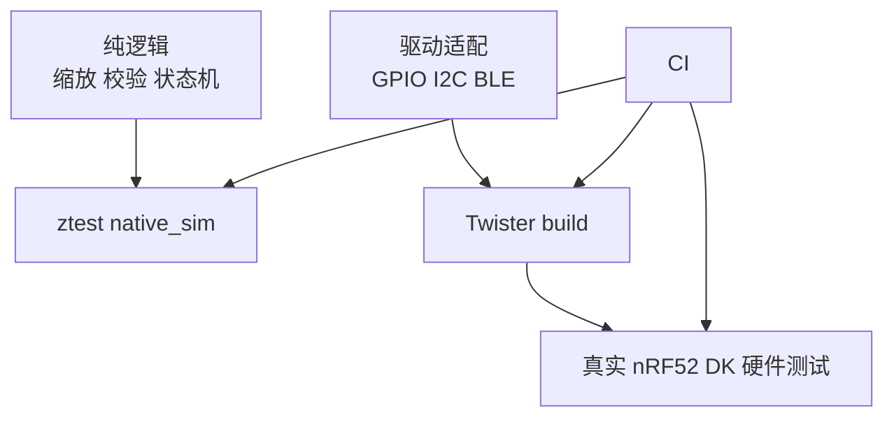
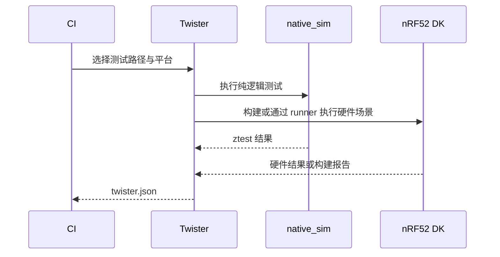

硬件项目不能只靠“烧到板上试一下”。Zephyr 的 ztest 用于单元和集成断言，Twister 负责发现、构建和执行测试场景。**测试的关键是把纯逻辑、驱动依赖和真实硬件行为分开，不能要求 native 模拟器替代 nRF52832 的无线与时钟验证。**

官方入口见 [Twister](https://docs.zephyrproject.org/latest/develop/twister/index.html)。

## 一、测试分层



【图1：模拟测试、构建测试和硬件测试各自覆盖不同风险】

传感器缩放、配置范围和 DFU 状态判断应尽量做成无硬件依赖函数；I2C ACK、BLE 空中包和功耗必须在真实板上验证。

## 二、最小 ztest

```c
#include <zephyr/ztest.h>

static int16_t clamp_temperature(int32_t value)
{
    if (value > 8500) {
        return 8500;
    }
    if (value < -4000) {
        return -4000;
    }
    return value;
}

ZTEST(env_logic, test_temperature_clamps_high)
{
    zassert_equal(clamp_temperature(9000), 8500, "high clamp failed");
}

ZTEST(env_logic, test_temperature_clamps_low)
{
    zassert_equal(clamp_temperature(-5000), -4000, "low clamp failed");
}

ZTEST_SUITE(env_logic, NULL, NULL, NULL, NULL, NULL);
```

测试应用需要独立 CMakeLists.txt、prj.conf 和 testcase.yaml。testcase.yaml 定义场景名、平台约束、tags 和 timeout，而不是把所有命令参数散落到 CI 脚本。

```yaml
tests:
  app.env_logic:
    tags:
      - env
      - unit
    platform_allow:
      - native_sim
      - nrf52dk/nrf52832
```

## 三、Twister 命令与报告

```powershell
west twister -T tests/env_logic -p native_sim -v
west twister -T tests/env_logic -p nrf52dk/nrf52832 -v
```

Twister 会生成报告文件并说明测试是构建、模拟执行还是硬件执行。没有真实硬件 runner 配置时，指定 nrf52dk/nrf52832 往往只能构建；不要把 build pass 写成“板上验证通过”。



【图2：Twister 汇总不同平台的验证结果】

## 四、工程化规则

| 类型 | 应测内容 | 运行位置 |
| --- | --- | --- |
| unit | payload 编解码、范围校验、状态机 | native_sim |
| integration | settings、队列、work 生命周期 | native_sim 或目标板 |
| hardware | I2C、GPIO 中断、BLE、功耗 | nRF52 DK |
| regression | 已修复 bug 的最小复现 | 最快可运行层 |

每一个线上缺陷都应留下一个可自动重跑的最小测试。测试名称描述行为，不描述内部函数；失败日志应能说明预期和实际值。CI 既要跑快速 native_sim，也要至少构建目标板，硬件农场可用时再执行真实板场景。

## 五、动手练习

1. 为采样周期范围校验写三个 ztest：下限、正常值和上限。
2. 在 native_sim 运行纯逻辑测试，再对 nrf52dk/nrf52832 运行构建验证。
3. 为按键消抖状态机写不依赖 GPIO 的测试。
4. 将一次 I2C NACK 修复转为可重复的错误处理测试。

## 六、里程碑自检

- [ ] 能区分 ztest 单元逻辑与硬件验证
- [ ] 会写 testcase.yaml 并用 west twister 选择目录和平台
- [ ] 知道 native_sim 不能证明无线、时钟和实际功耗
- [ ] 会读取 Twister 报告确认测试到底是 build 还是 run
- [ ] 能把缺陷转成最小回归测试

## 小结

测试工程化不是增加更多命令，而是让每类风险落到正确平台：逻辑交给 ztest，矩阵交给 Twister，电气和无线交给真实硬件。这样每次改动都有清楚、快速且可信的反馈。

> 🏷️ 标签：Zephyr · ztest · Twister · native_sim · CI · 单元测试 · 硬件测试
