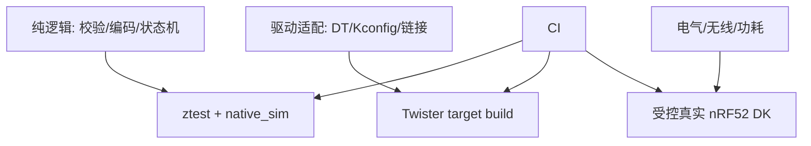
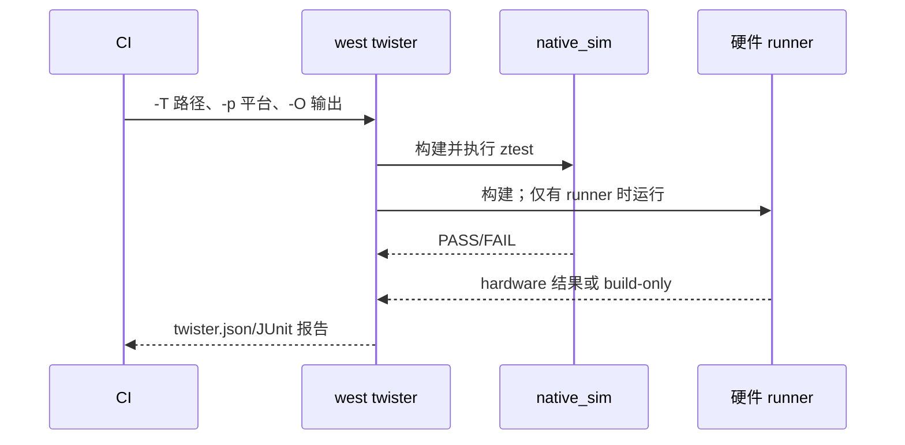

烧到板上看一次日志不是回归测试。ztest 在一个 Zephyr 测试应用内断言行为；Twister 发现测试场景、配置、构建并在支持的平台执行；真实硬件仍负责 I2C 电气、无线空口、时钟和功耗等模拟器无法证明的风险。三层都需要，但不能互相冒充。

本文以第 25 篇“采样间隔校验”这种纯逻辑为例。Twister 正在将 per-application 元数据统一到 `tests.yaml`；新工程使用它，并且绝不能与内容相同的 `testcase.yaml` 同时存在，否则会被重复发现。实际支持的文件名和 schema 必须以所检出的 Zephyr 4.4.x `west twister --help` 与文档为准。参考 [Twister](https://docs.zephyrproject.org/4.4.0/develop/test/twister.html) 与 [ztest](https://docs.zephyrproject.org/4.4.0/develop/test/ztest.html)。

## 一、测试金字塔先于测试命令

最底层是纯逻辑 seam：把范围校验、payload 编码、退避和状态转换写成没有 device、线程或全局 Bluetooth 状态的函数，才能在 host 上快速穷举边界。中层测试验证 Zephyr 配置闭环，例如正确的 CMake source、Kconfig、DTS 和链接；它能发现“函数正确但目标根本没编入”的问题。顶层硬件测试才验证 I2C 上拉、无线空口、时钟、功耗和 reset，这些都不能由 native_sim 推断。

ztest fixture 的生命周期是每个 suite 的 setup/teardown 和每个 case 的前后钩子；fixture 用于制造独立、可重复的可变状态，不应用来保存跨 case 的结果。Twister 的生命周期不同：它发现 YAML 场景，为每个 scenario/platform 解析配置、构建、决定是否能运行，再把 status 和日志写入报告。一个 PASS 必须同时说明它属于哪个层级、在哪个平台实际运行、并留下可检索工件。

mock/fake 的边界也由这个模型决定：fake 可重现 storage/I2C/BLE 适配层的成功和 errno 序列；mock 验证调用契约；二者都不能证明焊盘波形或手机订阅。CI 应先快跑 pure/native_sim，再构建目标板，最后由受控硬件 runner 采集真实证据，不能把 build-only 命名为硬件通过。

## 二、测试边界与执行路径





## 三、可复制的测试项目

```text
tests/env_interval/
├── CMakeLists.txt
├── prj.conf
├── tests.yaml                   # Twister 场景元数据
├── src/
│   └── interval.c               # production logic，不依赖 BLE/I2C
├── include/
│   └── env_interval.h
└── tests/
    └── test_interval.c          # ztest fixture/table cases
```

`include/env_interval.h` 把业务规则写成稳定 API。它不读取 settings、不分配内存、不访问设备，因此 native_sim 能执行。

```c
#ifndef ENV_INTERVAL_H_
#define ENV_INTERVAL_H_
#include <stdbool.h>
#include <stdint.h>
bool env_interval_is_valid(uint32_t interval_ms);
uint32_t env_interval_clamp(uint32_t interval_ms);
#endif
```

`src/interval.c`：

```c
#include <env_interval.h>
#define ENV_INTERVAL_MIN_MS 1000U
#define ENV_INTERVAL_MAX_MS 3600000U

/**
 * @brief 判断采样周期是否能安全写入持久化配置。
 * @param interval_ms 周期，单位毫秒。
 * @return true 表示位于含端点的 [1000, 3600000] 区间。
 */
bool env_interval_is_valid(uint32_t interval_ms)
{
    return interval_ms >= ENV_INTERVAL_MIN_MS && interval_ms <= ENV_INTERVAL_MAX_MS;
}

/**
 * @brief 将请求周期夹紧到产品允许范围。
 * @param interval_ms 请求值，单位毫秒。
 * @return 位于允许范围的周期；不表示该值已保存。
 */
uint32_t env_interval_clamp(uint32_t interval_ms)
{
    if (interval_ms < ENV_INTERVAL_MIN_MS) { return ENV_INTERVAL_MIN_MS; }
    if (interval_ms > ENV_INTERVAL_MAX_MS) { return ENV_INTERVAL_MAX_MS; }
    return interval_ms;
}
```

`CMakeLists.txt` 一次构建生产逻辑和测试；不要在测试中 `#include` 另一个 `.c` 文件，否则生产对象和测试对象的链接边界失真：

```cmake
cmake_minimum_required(VERSION 3.20.0)
find_package(Zephyr REQUIRED HINTS $ENV{ZEPHYR_BASE})
project(env_interval_test)
target_include_directories(app PRIVATE include)
target_sources(app PRIVATE src/interval.c tests/test_interval.c)
```

`prj.conf`：

```ini
CONFIG_ZTEST=y
CONFIG_ZTEST_NEW_API=y
CONFIG_MAIN_STACK_SIZE=1024
```

`tests/test_interval.c`：fixture 每个 case 获得独立可变状态；表驱动覆盖下界、正常值和上界，错误信息同时报告输入与期望。

```c
#include <zephyr/ztest.h>
#include <env_interval.h>

struct interval_case { uint32_t input; bool valid; uint32_t clamped; };
static const struct interval_case cases[] = {
    { 999U, false, 1000U }, { 1000U, true, 1000U },
    { 5000U, true, 5000U }, { 3600000U, true, 3600000U },
    { 3600001U, false, 3600000U },
};
struct interval_fixture { uint32_t cases_run; };
static void *interval_setup(void) { static struct interval_fixture fixture; fixture.cases_run=0; return &fixture; }

ZTEST_F(interval, test_table_validation_and_clamp)
{
    for (size_t i = 0; i < ARRAY_SIZE(cases); ++i) {
        zassert_equal(env_interval_is_valid(cases[i].input), cases[i].valid, "valid input=%u", cases[i].input);
        zassert_equal(env_interval_clamp(cases[i].input), cases[i].clamped, "clamp input=%u", cases[i].input);
        fixture->cases_run++;
    }
    zassert_equal(fixture->cases_run, ARRAY_SIZE(cases), "case count");
}

ZTEST_F(interval, test_zero_is_rejected_and_clamped)
{
    zassert_false(env_interval_is_valid(0U), "zero must be rejected");
    zassert_equal(env_interval_clamp(0U), 1000U, "zero clamps to minimum");
}

ZTEST_SUITE(interval, NULL, interval_setup, NULL, NULL, NULL);
```

`tests.yaml`：场景 ID 必须唯一、无空格；`harness: ztest` 让 Twister 使用 ztest 输出判断。仅保留此一个元数据文件；升级 Zephyr 时先用 `west twister --help` 和该版本文档复核 schema。

```yaml
tests:
  env.node.interval:
    tags:
      - unit
      - env_node
    harness: ztest
    platform_allow:
      - native_sim
      - nrf52dk/nrf52832
    integration_platforms:
      - native_sim
```

## 四、命令、报告和硬件区别

```powershell
# 纯逻辑：构建并在宿主模拟器实际运行
west twister -T tests/env_interval -p native_sim -v -O twister-out/native

# 目标板：至少验证 target 链接、DTS/Kconfig；是否运行取决于 runner/硬件 farm
west twister -T tests/env_interval -p nrf52dk/nrf52832 -v -O twister-out/nrf52

# 查看执行计划和结构化结果
Get-ChildItem twister-out -Recurse -Include twister.json,twister.xml,twister_report.xml,testplan.json
```

`-T` 限定测试目录，`-p` 选择 platform，`-O` 设定输出根目录，`-v` 显示每个场景实际是 run、build 还是 skip。成功 build 的 nRF52 场景绝不等于板上 I2C/BLE 已通过；只有报告明确记录 runner 执行和结果，或受控硬件 farm 的采集日志，才能称为硬件验证。

硬件场景推荐从“可自动确认的串口协议”开始：烧录后测试固件输出固定 `ztest` 结果，runner 重置、捕获并由 harness 判定。需要人工插拔、手机配对、示波器或电流计的项目留在硬件验收清单，不要强行伪装为 native_sim 单元测试。

## 五、fakes、mocks 与分层

| 依赖 | 单元测试替身 | 必须留给硬件 |
| --- | --- | --- |
| settings Flash | 将“读/写成功或 errno”抽为接口，再用 fake | 掉电、磨损、分区大小 |
| I2C sensor | fake 返回样本/NACK 序列 | 上拉、地址、波形、供电 |
| BLE notify | fake 记录 payload 和 CCC 状态 | 空口、配对、手机缓存、吞吐 |
| 时间/退避 | 注入 tick 或延迟策略 | RTC 精度、深睡唤醒 |

mock 断言“是否以正确参数调用依赖”，fake 提供简化但可工作的依赖。两者都不应在生产源码中覆盖 Zephyr driver 符号；使用模块接口注入，才能避免测试配置偶然改变真机行为。遇到缺陷，先写一个最小复现 table case，再修生产函数，再把该 case 固定在 CI。

## 六、CI 与回归工作流

下例仅运行它能诚实声称的 native_sim 单元测试和目标板构建；硬件 farm job 应使用组织的 runner 凭据和板锁，不能把凭据写进仓库。

```yaml
name: zephyr-tests
on: [push, pull_request]
jobs:
  unit-and-build:
    runs-on: ubuntu-latest
    steps:
      - uses: actions/checkout@v4
      - name: Run native simulation
        run: west twister -T tests/env_interval -p native_sim -v -O twister-out/native
      - name: Build target configuration
        run: west twister -T tests/env_interval -p nrf52dk/nrf52832 -v -O twister-out/nrf52
      - name: Upload reports
        uses: actions/upload-artifact@v4
        with:
          name: twister-reports
          path: twister-out
```

失败处理顺序：先打开 `twister.json` 查场景状态，再看该平台的 build log、`zephyr.dts` 和 `.config`；确认失败发生在配置、编译、链接、运行、harness 还是硬件连接层。不要看到 `SKIP`/`BUILD ONLY` 就重试十次，更不能把它改名为 PASS。

## 七、练习与里程碑

1. 先运行 `native_sim`，确认两个 ztest case 实际执行；故意把最小值改为 999，观察失败信息。
2. 为 1001、3599999 和 `UINT32_MAX` 增加表项，说明边界等价类。
3. 对 `nrf52dk/nrf52832` 运行 Twister，区分报告中的 build-only、run、skip 状态。
4. 给第 25 篇 settings 模块抽一个 storage fake，测试保存失败不改变内存策略；将掉电测试保留在真机。
5. 为一次真实 I2C NACK 或 BLE CCC 缺陷写纯逻辑回归 case，再把电气/空口复验加入硬件清单。

## 小结

测试工程化的目标是让每个结论匹配证据层级：纯逻辑交给 ztest，场景矩阵交给 Twister，电气、无线和功耗结论留给真实硬件。

> 🏷️ 标签：Zephyr · ztest · Twister · native_sim · CI · 单元测试 · 硬件测试
