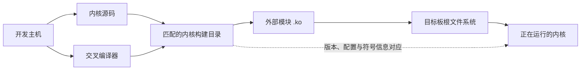

一个驱动模块在 PC 上顺利编译出 `.ko` 文件，复制到开发板后却不一定能够加载。它可能被内核报告为 `invalid module format`，也可能因为找不到符号而失败。这里最容易产生的误解，是把“编译成功”当成了“适合这块板上的内核”。普通应用程序主要依赖处理器架构和用户空间库，内核模块却会在加载后成为内核的一部分，因此它和正在运行的内核有更紧密的对应关系。

这正是驱动实验要先整理环境的原因。我们并不急着安装一长串软件，也不先写模块代码，而是先回答一个更基础的问题：PC 上的哪一份源码、哪一次构建和哪一套编译器，对应板上此刻运行的内核？只要这条关系说得清楚，后续的编译错误、加载错误和“改了代码却没有变化”就都有了可以追查的起点。

本文的通用说明以 Linux 6.12 为基线，板级部分沿用本项目的 RV1126 场景。RV1126 厂商 SDK 常见的内核版本、构建脚本和目录布局可能与 Linux 6.12 不同，遇到差异时会单独说明，而不会把厂商分支的做法当作通用规则。

## 先看清一份模块经过了哪些环境

驱动开发通常同时使用两台机器。开发主机负责保存源码并完成编译，目标板负责运行内核和观察驱动行为。交叉编译器运行在主机上，生成适合目标处理器的代码；内核源码提供接口定义，内核构建目录则保存这一次构建采用的配置和生成信息。模块编译完成后，它被复制到目标板的根文件系统，再由正在运行的内核加载。

这几个对象可以用一条关系串起来：



图中最关键的不是复制文件的箭头，而是构建目录和运行内核之间的对应关系。只下载同版本号的“干净源码”往往还不够，因为实际镜像可能带有额外的版本后缀、不同配置，或者来自厂商提交。反过来，根文件系统中的 `/lib/modules/` 负责存放和组织模块，却不能单独说明这些模块是由哪份内核构建出来的。我们需要从板端和主机两边各取一组事实，再把它们对上。

## 从正在运行的内核开始

先登录目标板，执行下面三条只读命令：

```sh
uname -a
uname -r
cat /proc/version
```

`uname -r` 给出内核的 release 字符串，例如版本号后面还可能带有 `-custom` 一类后缀。这个字符串会参与模块目录命名和加载时的版本检查，因此记录时应保留完整输出，不要只摘取前面的主版本号。`uname -a` 在此基础上还会显示机器架构和构建信息，可以帮助发现把 64 位模块拿到 32 位系统之类的明显错误。`/proc/version` 通常还包含构建内核时使用的编译器信息，不过它适合用来核对线索，不能代替源码提交和构建配置记录。

这里不提供一段假想的 RV1126 输出。不同板卡镜像可能来自不同 SDK 和构建批次，真正有价值的是你从当前实验板上读到的原始结果。如果暂时没有可登录的目标板，可以先完成主机侧整理，但要把板端版本留作“未确认”，而不是用 SDK 文档中的示例值代替。

接着看看运行内核是否公开了自己的配置：

```sh
zcat /proc/config.gz | head
```

能够看到以 `CONFIG_` 开头的内容，说明内核启用了导出配置的功能，`/proc/config.gz` 可以作为板端配置快照。若文件不存在，或者系统没有 `zcat`，并不等于内核没有配置；很多精简系统不会提供这个入口。此时应回到生成该镜像的内核构建目录，使用其中的 `.config`。这份文件只有在能够证明它确实生成了当前板上镜像时才有意义，不能因为文件名相同就默认二者对应。

有些发行版会在模块目录中放置一个 `build` 符号链接，指向为当前内核准备好的源码或头文件目录。可以这样查看它最终指向哪里：

```sh
readlink -f /lib/modules/$(uname -r)/build
```

命令输出一个规范化路径时，可以继续检查该目录的 release 和配置；没有输出或提示路径不存在，则表示当前根文件系统没有安装这条链接。它不会妨碍内核运行，也不能据此判断 SDK 中没有内核源码，只是后续编译外部模块时需要在主机上显式指定构建目录。

> **RV1126 差异：** 本项目现有资料只能确认 RV1126 场景通常使用 ARM 32 位交叉工具链，具体前缀由 SDK 决定；没有证据表明目标板一定提供 `/proc/config.gz` 或 `/lib/modules/$(uname -r)/build`。因此这两条命令是环境探查，不是预设条件。

## 在主机上找到与它对应的构建目录

回到开发主机，先进入内核源码根目录。顶层 `Makefile` 能计算这棵源码当前形成的 release 字符串：

```sh
make -s kernelrelease
```

`-s` 只让 `make` 少打印一些过程信息，预期结果是一行 release 字符串。它应当和板端 `uname -r` 的完整输出一致。如果不一致，先不要靠修改模块文件名绕过去，而要检查是不是选错了源码分支、遗漏了厂商的 `LOCALVERSION` 设置，或者没有使用生成板上镜像时的构建配置。

源码和构建结果也可能分开放置。内核构建时若使用了 `O=`，`.config`、生成头文件和其他中间产物会写入单独的输出目录。核对 release 时也要指向同一个目录，并带上原构建使用的架构和工具链环境，例如：

```sh
make -s O=/path/to/kernel-build \
  ARCH="$ARCH" CROSS_COMPILE="$CROSS_COMPILE" kernelrelease
```

这里的路径和变量是写法示例，应该替换为当前工程的实际值。厂商 SDK 若通过顶层脚本导出环境变量或追加版本后缀，直接绕过脚本可能得到不同结果；可以先阅读脚本如何调用内核 `make`，再在相同环境中执行核对命令。

最后查看真正会被调用的交叉编译器：

```sh
${CROSS_COMPILE}gcc --version
${CROSS_COMPILE}gcc -dumpmachine
```

第一条显示编译器版本，第二条输出目标 triplet，也就是编译器面向的目标体系结构和 ABI 名称。`CROSS_COMPILE` 为空时，这条命令会调用主机的 `gcc`；前缀写错时，通常会直接得到“命令未找到”。前一种情况尤其容易被忽略，因为源码可能仍能开始编译，生成物却面向了错误的处理器。对 RV1126，项目资料给出的常见前缀包括 `arm-linux-gnueabihf-` 和厂商自定义前缀，但实验记录应保存 `${CROSS_COMPILE}gcc -dumpmachine` 的真实输出，而不是从前缀猜测。

交叉编译器之外，内核构建还会调用主机上的 `make`、shell、链接器和若干配置工具。Linux 6.12 文档给出的基础下限包括 GNU C 5.1、GNU make 4.0、Bash 4.2 和 binutils 2.25，具体内核配置还可能启用其他工具。这里不提供一条固定的安装命令，因为发行版包名和厂商 SDK 的测试环境并不相同；先对照当前源码的 `Documentation/process/changes.rst` 与 SDK 说明，再用各工具的 `--version` 输出确认实际环境，得到的信息比照搬另一发行版的软件包列表更可靠。

## 源码树里先认识六个位置

内核源码规模很大，第一次打开时没有必要逐层浏览。当前阶段只需要认识几个以后会反复返回的位置，并理解“源码”与“本次构建结果”并不是同一个概念。

`Documentation/` 是随内核源码维护的说明文档。学习某个构建选项或子系统接口时，它比零散博客更接近当前版本；本系列采用的 Linux 6.12 外部模块说明和编译环境要求也来自这里。`drivers/` 保存各类驱动和子系统实现，后面阅读 GPIO、I2C、SPI 等框架时会不断进入它的子目录。`include/` 保存跨目录使用的接口定义，看到驱动中的 `#include <linux/...>` 时，通常可以从这里找到对应声明。

`arch/` 放置体系结构相关代码。对通用 Linux 6.12，具体进入哪个子目录取决于目标架构；在本项目的 RV1126 SDK 中，现有资料将它作为 ARM 32 位平台处理，所以板级设备树和架构构建内容通常从 `arch/arm/` 一侧寻找。这个结论描述的是当前项目场景，不代表所有 Rockchip SoC 都使用相同架构。`scripts/` 则包含 Kbuild 和配置过程调用的辅助脚本，遇到构建系统报错时，有时会沿日志进入这里，但初学阶段不需要通读。

第六个位置是构建输出。它可能与源码混在同一棵目录，也可能位于 `O=/path/to/kernel-build` 指定的独立目录。对外部模块来说，真正重要的是后者保存的 `.config`、生成头文件和符号信息。Linux 6.12 的官方 Kbuild 文档把外部模块所依赖的目录称为内核目录，它可以是内核源码目录，也可以是分离的输出目录，前提是其中已经具备本次内核构建所需的信息。

如果只有配置好的源码树，`modules_prepare` 可以补齐编译外部模块所需的一部分生成文件。不过，当内核启用了 `CONFIG_MODVERSIONS` 时，仅执行 `modules_prepare` 不会生成 `Module.symvers`，仍需保留一次完整内核构建产生的符号版本信息。这也是为什么“版本号相同的源码”不总能代替“生成当前镜像的构建目录”。下一篇真正编译模块时，我们会把这个目录交给 Kbuild。

> **RV1126 差异：** 厂商内核分支可能在通用目录之外增加脚本和私有代码，顶层 SDK 也可能把 kernel 包在统一构建入口之下。先从实际构建日志找到传给内核 `make` 的源码路径、输出路径、`ARCH` 和 `CROSS_COMPILE`，再套用上面的通用关系。

## 留下一份能在下次实验中复用的记录

现在可以把两端的信息合成一份简短记录。它不是交付检查表，而是后续每次实验的坐标。新建一个文本文件，按实际输出填写下面这些字段；暂时无法确认的内容直接写“未确认”，并保留对应命令的原始输出。

```text
记录日期：
目标板与板上镜像：
运行内核 release：
内核源码位置：
源码提交：
内核构建输出位置：
配置文件位置：
编译器 triplet 与版本：
本次镜像使用的 DTB：
模块部署目录：
补充观察：
```

`运行内核 release` 来自板端 `uname -r`，而 `源码提交` 可以在主机源码仓库中用 `git rev-parse HEAD` 取得。这两项放在一起，能够区分“版本字符串看起来相同、源码内容却不同”的情况。`配置文件位置` 和 `内核构建输出位置` 说明模块编译将从哪里取得生成头文件及符号信息；以后出现某个接口未启用或符号版本不一致时，排查会回到这里。

编译器记录同时保存 `-dumpmachine` 和 `--version` 输出，用来判断目标架构、ABI 与工具链版本是否发生变化。`目标板与板上镜像`、`本次镜像使用的 DTB` 则把软件环境连回具体硬件；更换整包镜像或 DTB 后，即使模块源码未改，设备是否出现也可能不同。无法从当前启动日志或烧录记录确认 DTB 时，就如实标记，等拿到证据再补充。

`模块部署目录` 记录准备把 `.ko` 复制到板上的实际位置。后续用 `insmod` 加载时可以给出模块文件的完整路径；等讲到模块依赖和 `modprobe` 时，再讨论 `/lib/modules/<release>/` 下的组织方式。现在先固定一个不会与旧实验文件混淆的位置，并在每次替换后核对文件时间或校验值。

## 让环境先形成一个闭环

到这里，我们还没有编写一行驱动代码，却已经建立了第一个重要结论：模块面向的不是一个抽象的“ARM Linux”，而是某块板上正在运行的具体内核。主机上的源码提交、构建配置、输出目录和交叉编译器共同决定 `.ko` 的身份，目标板的镜像、DTB 和根文件系统决定它最终进入怎样的运行环境。

可以用记录中的信息做一次交叉核对：板端 `uname -r` 与主机 `make -s kernelrelease` 是否一致，编译器目标是否符合板卡架构，配置和构建输出是否确实来自同一次内核构建。某一项还没有证据并不可怕，清楚地保留“未确认”比填入一个看似合理的路径更有助于后续实验。

关于外部模块构建，Linux 6.12 的官方入口是 [Building External Modules](https://docs.kernel.org/6.12/kbuild/modules.html)；宿主工具的最低版本可以对照 [Minimal requirements to compile the Kernel](https://docs.kernel.org/6.12/process/changes.html)。这些文档给出通用 Kbuild 规则，具体 RV1126 SDK 的脚本、工具链和输出路径仍以手头源码与构建日志为准。

环境关系固定之后，下一个问题自然出现了：一个 `.ko` 文件里究竟有什么，内核在执行 `insmod` 时又做了什么？下一篇将从最小模块开始，完成编译、复制、加载和卸载，并把这里记录的内核构建目录第一次真正交给 Kbuild。
