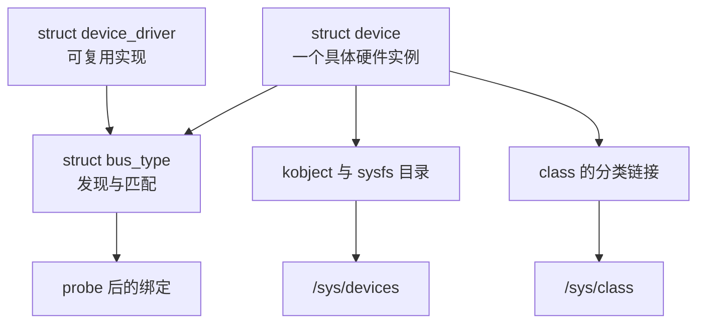

上一章加载 LED 模块后出现了两个看似相近的名字：`/dev/rv1126_led0` 让应用打开字符设备，`/sys/class/rv1126_led/rv1126_led0` 则让我们看到一个 sysfs 路径。前者是 VFS 的设备节点，后者不是另一份驱动接口，而是内核对象关系在用户空间中的可观察投影。用 `readlink -f` 跟随它，通常会走到 `/sys/devices/...` 下的某个实际设备目录。

这条链接提示了驱动代码很快会遇到的分工问题。第 4 篇的模块既创建字符设备，又直接拿 GPIO 编号，还在加载参数里携带板级信息。它能够教学，却不适合描述多个同类设备或由固件发现的硬件。Linux 设备模型把“设备是什么”“哪个驱动实现它”“它挂在哪条总线”和“用户怎样按类别看它”拆成相关但不同的对象。

## 1. 一个设备不是一个设备文件

在设备模型中，`struct device` 表示一个具体设备实例或逻辑设备。它有名字、父设备、所属 bus、可选 driver、资源和用于生命周期管理的引用。一个 I2C 触摸控制器、一个 platform 外设和第 4 篇手工创建的 `rv1126_led0` 都可以有 `struct device`，但它们未必都对应同一种 `/dev` 节点；有些只通过 sysfs、网络栈或专用子系统暴露服务。

`struct device_driver` 表示驱动这一侧可复用的实现。它不等于一次加载的模块：一个模块可以包含多个驱动，一个驱动也可能管理多个 device。`struct bus_type` 定义设备与驱动相遇的场所和匹配规则，例如 platform、I2C、SPI、USB 和 PCI。bus 为每个 device 寻找合适的 driver，匹配成功后调用驱动的 `probe`，随后把两者绑定。

`struct class` 是另一条观察轴。它按功能把已经存在的设备呈现给用户空间，而不表达物理连接。例如 `/sys/class/tty/` 可以汇集不同总线上的终端设备；第 4 篇的 `rv1126_led` class 只是为字符设备创建一个便于发现的类别。class 不能代替 bus，也不负责设备和驱动匹配。



这个模型不是为多写几层 C 结构体而设计的。它让内核可以在不依赖某个驱动私有全局变量的前提下建立层次、触发 uevent、展示资源，并把驱动与设备的出现顺序解耦。第 6 篇的 platform 总线会把图中的匹配和 `probe` 变成一段可运行代码。

### 1.1 kobject 是对象进入 sysfs 的共同基础

`struct kobject` 是许多内核对象共有的基础设施。它保存对象名、父对象、所属 kset、类型和引用计数，并通过 `kobject_add()`、`kobject_put()` 等操作参与 sysfs 目录的创建和最终释放。`struct device` 内嵌 `struct kobject kobj`，因此设备注册后可以在 sysfs 中拥有目录；bus、driver 和 class 也有相应的 kobject 基础。

不需要在普通驱动里手动分配一个裸 `kobject` 才能“使用设备模型”。对于设备驱动，注册 `struct device` 或由 `device_create()` 创建逻辑设备，核心会完成与 kobject 的连接。真正需要记住的是生命周期含义：取得了一个长期保存的 device 指针，就要理解它的引用如何保持；删除对象时，sysfs 目录消失不代表内存一定立即释放。复杂引用计数问题将在后面的驱动生命周期章节再展开，这里只把 sysfs 看作对象关系的窗口。

## 2. 在正在运行的系统里读这张地图

不必先写新模块，先观察第 4 篇的设备。加载 `rv1126_led_char` 后执行：

```sh
readlink -f /sys/class/rv1126_led/rv1126_led0
ls -l /sys/class/rv1126_led/rv1126_led0
cat /sys/class/rv1126_led/rv1126_led0/uevent
find /sys/bus -maxdepth 1 -mindepth 1 -type d | head
```

`/sys/class/rv1126_led/rv1126_led0` 是 class 视图；它最终指向的位置才是设备的主目录。`uevent` 中的 `MAJOR`、`MINOR`、`DEVNAME` 是 `device_create()` 用来通知用户空间创建设备节点的关键信息。该实验设备没有挂到真实硬件 bus，因此它可能位于 `/sys/devices/virtual/`；这不是“假的 sysfs”，而是没有物理父总线时的合理拓扑。

再任选一个已有 platform 设备和一个 I2C 设备比较：

```sh
find /sys/bus/platform/devices -maxdepth 1 -mindepth 1 -printf '%f\n' | head
find /sys/bus/i2c/devices -maxdepth 1 -mindepth 1 -printf '%f\n' | head
```

每条 bus 目录通常同时有 `devices/` 和 `drivers/`：前者是已注册设备，后者是已注册驱动。设备目录中常能看到 `driver` 链接，它指向绑定后的驱动目录；驱动目录中的 `bind`、`unbind` 是调试接口，不要把它们当作入门实验中的日常控制手段。现在只需要由目录树验证一个事实：设备、驱动和类别各有位置，彼此通过链接关联。

## 3. 用一个最小模块亲手创建 class 与 device

下面模块不注册字符设备，也不操作硬件。它的目标是让 class 和 device 单独可见，避免把 sysfs 观察和 GPIO、`cdev` 混在一起。`device_create()` 的 `devt` 传入 0，所以不会生成 `/dev` 节点；它仍会创建一个 device，并在 `/sys/class/model_demo/` 下建立分类入口。

```c
#include <linux/device.h>
#include <linux/module.h>

static struct class *model_class;
static struct device *model_device;

static int __init model_demo_init(void)
{
    model_class = class_create("model_demo");
    if (IS_ERR(model_class))
        return PTR_ERR(model_class);

    model_device = device_create(model_class, NULL, 0, NULL,
                                 "model_demo0");
    if (IS_ERR(model_device)) {
        class_destroy(model_class);
        return PTR_ERR(model_device);
    }

    pr_info("model_demo: class and device registered\n");
    return 0;
}

static void __exit model_demo_exit(void)
{
    device_destroy(model_class, 0);
    class_destroy(model_class);
}

module_init(model_demo_init);
module_exit(model_demo_exit);
MODULE_LICENSE("GPL");
MODULE_DESCRIPTION("Small device-model observation module");
```

Linux 6.12 的 `class_create()` 只接收 class 名称。某些 RV1126 厂商 SDK 仍使用较旧的两参数形式 `class_create(THIS_MODULE, "model_demo")`，因此应以当前编译树的 `include/linux/device/class.h` 原型为准。这正是第 1 篇强调“模块编译目录必须对应运行内核”的具体例子。

同目录的 `Kbuild` 和构建命令与前文一致：

```make
obj-m += model_demo.o
```

```sh
make -C "$KERNEL_BUILD" M="$PWD" \
  ARCH=arm CROSS_COMPILE="$CROSS_COMPILE" modules
sudo insmod ./model_demo.ko
readlink -f /sys/class/model_demo/model_demo0
find /sys/class/model_demo/model_demo0 -maxdepth 1 -printf '%f\n'
dmesg | tail -n 10
sudo rmmod model_demo
```

路径应解析到 `/sys/devices/virtual/model_demo/model_demo0` 或同等的 virtual 分支，具体中间目录由内核实现决定。卸载后 class 链接和设备目录消失。这个实验说明 `class` 是分类入口而非硬件发现机制：没有 bus，也没有 driver match，仍然可以有一个 class device。

## 4. 先建立匹配的直觉，不抢跑实现细节

当一个真实设备出现时，bus 会对设备和驱动执行自己的 `match()`。platform 常依据设备名或设备树中的 `compatible`，I2C 常依据设备 ID 或 `compatible`，USB 和 PCI 则有各自的 ID 表。匹配成功并不等于驱动已经完成初始化：它只是得到进入 `probe()` 的资格。`probe()` 取得资源、建立私有状态并注册用户接口；失败时设备仍在 bus 上，之后可以由其他驱动或重新注册的驱动再次尝试。

这比第 4 篇在模块加载时直接初始化 LED 更容易扩展。设备可以先由固件描述并注册，驱动模块稍后才加载；也可以先有驱动、再由总线发现设备。两种顺序最终都汇聚在同一个 `match` 与 `probe` 过程。下一篇将选择最常见的片上外设总线，实际写出一个 `platform_device`、一个 `platform_driver` 和一份命名资源。

## 5. 参考资料

- Linux Kernel Documentation, [Driver Model overview](https://docs.kernel.org/6.12/driver-api/driver-model/overview.html) 与 [Device classes](https://docs.kernel.org/6.12/driver-api/driver-model/class.html)。
- Linux Kernel Documentation, [sysfs](https://docs.kernel.org/6.12/filesystems/sysfs.html)。
- Linux kernel stable source, [include/linux/device.h (v6.12)](https://git.kernel.org/pub/scm/linux/kernel/git/stable/linux.git/tree/include/linux/device.h?h=v6.12), [drivers/base/core.c (v6.12)](https://git.kernel.org/pub/scm/linux/kernel/git/stable/linux.git/tree/drivers/base/core.c?h=v6.12), [lib/kobject.c (v6.12)](https://git.kernel.org/pub/scm/linux/kernel/git/stable/linux.git/tree/lib/kobject.c?h=v6.12)。
- EmbedFire, [Linux 内核设备模型](https://doc.embedfire.com/linux/rk356x/driver/zh/latest/linux_driver/base_device_model.html) 与 [Sysfs 文件系统](https://doc.embedfire.com/linux/rk356x/driver/zh/latest/linux_driver/base_sysfs.html)，用于课程脉络参考。
