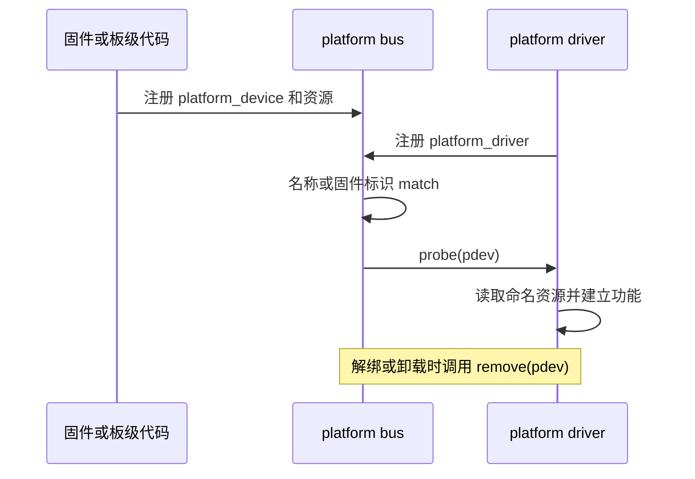

第 5 篇把 `/sys/class` 和 `/sys/devices` 分开看之后，仍留下一个关键问题：一个设备对象和一个驱动对象到底何时相连？若 LED 驱动继续在 `module_init()` 中直接请求 GPIO，它只是在“模块加载”这个时刻初始化，设备模型无法表达 LED 来自何处，也无法让同一驱动自然管理多个实例。

片上外设常用 platform 总线解决这个问题。SoC 上的 GPIO、串口、定时器和许多自定义 IP 并不通过可枚举的外接链路出现；固件或板级代码知道它们的地址、中断、时钟和兼容型号，再将这些信息注册为 `platform_device`。驱动注册为 `platform_driver` 后，由 platform 总线尝试匹配；只有匹配成功，才调用 `probe()`。

## 1. platform 设备携带的不是驱动私有常量

`struct platform_device` 在普通 `struct device` 外，提供了名称、ID 和资源列表。资源用 `struct resource` 表示，最常见的是内存映射寄存器范围 `IORESOURCE_MEM` 和中断 `IORESOURCE_IRQ`。资源名不是装饰：驱动可以用 `platform_get_resource_byname()` 按语义取得 `"registers"` 或 `"alarm"`，不用假设数组中的第 0 项永远是哪一种资源。

`struct platform_driver` 的核心是 `probe` 与 `remove` 回调。`probe(struct platform_device *pdev)` 从传入的 device 找资源、创建私有状态、注册子系统接口；`remove()` 在设备解绑或驱动卸载时撤销由 probe 建立的接口。这里先不引入 devres、电源管理和实际 MMIO 映射，因为它们会遮住最重要的因果关系：资源属于 device，初始化属于匹配成功后的 probe。



第 5 篇已经介绍过 bus 并不等于 class。platform bus 的设备会出现在 `/sys/bus/platform/devices/`，驱动会出现在 `/sys/bus/platform/drivers/`；驱动若再创建字符节点或 LED class，才会在 `/sys/class/` 出现另一条面向用户的视图。

### 1.1 match 先决定“谁有机会 probe”

platform 总线可以用三种线索匹配：设备树的 `compatible` 与驱动的 `of_match_table`，ACPI 的 ID 表，以及传统 platform 设备名称与驱动名称/ID 表。本篇的自注册设备没有设备树节点，故意使用相同的名称 `course-counter`，让过程易于观察。第 7 篇讲清 DTS 后，第 8 篇会把相同关系改为 `compatible` 驱动的 DT 设备。

`probe()` 不是“加载模块的另一个名字”。同一个驱动模块可能先加载，之后才有设备；也可能设备先存在，模块加载后立即为每个匹配设备分别调用一次 probe。把每个实例的状态放入 `pdev` 关联的私有空间，而不是静态全局变量，正是它能够管理多个设备的开始。

## 2. 一个可观察的最小 platform 实验

下列模块同时注册一个 driver 和一个 device。资源地址 `0x1000..0x10ff` 是刻意虚构的教学元数据，模块不会映射、读取或写入它，因此它不代表 RV1126 的任何寄存器，也不会操作硬件。这样我们能够安全观察资源如何进入 `probe()`，再在后续设备树文章中把“资源来自哪里”讲清楚。

```c
#include <linux/ioport.h>
#include <linux/module.h>
#include <linux/platform_device.h>

static struct resource course_resources[] = {
    {
        .name = "demo-registers",
        .start = 0x1000,
        .end = 0x10ff,
        .flags = IORESOURCE_MEM,
    },
};

static int course_probe(struct platform_device *pdev)
{
    struct resource *res;

    res = platform_get_resource_byname(pdev, IORESOURCE_MEM,
                                       "demo-registers");
    if (!res)
        return -ENODEV;

    pr_info("course-counter: probe %s, resource %pa-%pa\n",
            dev_name(&pdev->dev), &res->start, &res->end);
    return 0;
}

static void course_remove(struct platform_device *pdev)
{
    dev_info(&pdev->dev, "remove\n");
}

static struct platform_driver course_driver = {
    .probe = course_probe,
    .remove = course_remove,
    .driver = {
        .name = "course-counter",
    },
};

static struct platform_device *course_device;

static int __init course_init(void)
{
    int ret;

    ret = platform_driver_register(&course_driver);
    if (ret)
        return ret;

    course_device = platform_device_register_simple("course-counter",
                    PLATFORM_DEVID_AUTO, course_resources,
                    ARRAY_SIZE(course_resources));
    if (IS_ERR(course_device)) {
        ret = PTR_ERR(course_device);
        platform_driver_unregister(&course_driver);
        return ret;
    }
    return 0;
}

static void __exit course_exit(void)
{
    platform_device_unregister(course_device);
    platform_driver_unregister(&course_driver);
}

module_init(course_init);
module_exit(course_exit);
MODULE_LICENSE("GPL");
MODULE_DESCRIPTION("Minimal platform match and resource experiment");
```

调用顺序值得慢下来观察。`platform_driver_register()` 只把 driver 交给 bus，此时还没有本例 device，所以不会调用 probe。`platform_device_register_simple()` 创建并注册 device；总线发现名称可匹配，随即调用 `course_probe()`。模块退出时先注销 device，平台核心会解绑它并调用 `course_remove()`；随后注销 driver。这个顺序让 remove 在 driver 仍有效时执行。

`platform_get_resource_byname()` 返回的是设备拥有的资源描述，而不是已经可安全访问的内存。真实寄存器驱动通常还要申请并映射该范围，处理时钟、复位和并发访问；这些部分依赖硬件 binding，不应从一个虚构范围推导出来。

## 3. 编译并在 sysfs 中看见绑定关系

保存源文件为 `platform_course.c`，并放置：

```make
obj-m += platform_course.o
```

```sh
make -C "$KERNEL_BUILD" M="$PWD" \
  ARCH=arm CROSS_COMPILE="$CROSS_COMPILE" modules
sudo insmod ./platform_course.ko
dmesg | tail -n 20
find /sys/bus/platform/devices -maxdepth 1 -name 'course-counter*' -printf '%f\n'
find /sys/bus/platform/drivers/course-counter -maxdepth 1 -printf '%f\n'
```

内核会为 `PLATFORM_DEVID_AUTO` 分配一个实例后缀，因而设备名常类似 `course-counter.0`，不要把这串输出写死进脚本。找到实际目录后，继续检查：

```sh
dev=$(find /sys/bus/platform/devices -maxdepth 1 -name 'course-counter*' -print -quit)
readlink -f "$dev/driver"
cat "$dev/modalias"
cat "$dev/resource"
sudo rmmod platform_course
dmesg | tail -n 20
```

`driver` 链接应指向 `/sys/bus/platform/drivers/course-counter`；`modalias` 给出平台设备用于模块别名匹配的标识；`resource` 展示注册时携带的范围。日志先出现 probe，再在卸载时出现 remove。这里没有 `/dev` 节点，因为示例没有创建字符设备，也没有访问那段虚构范围。观察到这个“缺少”也很重要：platform 负责发现、匹配和资源交接，用户接口是 probe 中按实际功能另行建立的。

## 4. 从手工注册到设备树

真实 RV1126 系统不会为了每个片上外设在模块初始化函数里调用 `platform_device_register_simple()`。启动时，内核解析 DTB，把匹配的节点转成 platform device；driver 中加入如下表后，platform 的 OF 匹配可使用节点的 `compatible`：

```c
#include <linux/of.h>

static const struct of_device_id course_of_match[] = {
    { .compatible = "example,course-counter" },
    { }
};
MODULE_DEVICE_TABLE(of, course_of_match);

/* 放进 platform_driver.driver： */
.of_match_table = course_of_match,
```

`MODULE_DEVICE_TABLE()` 让构建工具从表中生成模块别名；它不会自行创建设备。设备树节点中的 `reg`、`interrupts`、`clocks` 和 GPIO 属性如何变成 `pdev` 资源，是下一篇和第 8 篇的主题。现在只要保留这条关系：本篇的手工 resource 与未来 DTS 中的资源都属于 device，`probe()` 消费它们，而不是把地址常量藏进 driver C 文件。

## 5. 参考资料

- Linux Kernel Documentation, [Platform Devices and Drivers](https://docs.kernel.org/6.12/driver-api/driver-model/platform.html)。
- Linux kernel stable source, [include/linux/platform_device.h (v6.12)](https://git.kernel.org/pub/scm/linux/kernel/git/stable/linux.git/tree/include/linux/platform_device.h?h=v6.12) 与 [drivers/base/platform.c (v6.12)](https://git.kernel.org/pub/scm/linux/kernel/git/stable/linux.git/tree/drivers/base/platform.c?h=v6.12)。
- Linux Kernel Documentation, [DeviceTree usage model](https://docs.kernel.org/6.12/devicetree/usage-model.html)，用于理解固件节点如何成为内核设备。
- EmbedFire, [Linux 平台设备驱动](https://doc.embedfire.com/linux/rk356x/driver/zh/latest/linux_driver/base_platform.html)，用于课程顺序参考；资源和匹配规则以 Linux 6.12 文档、源码和当前 SDK binding 为准。
