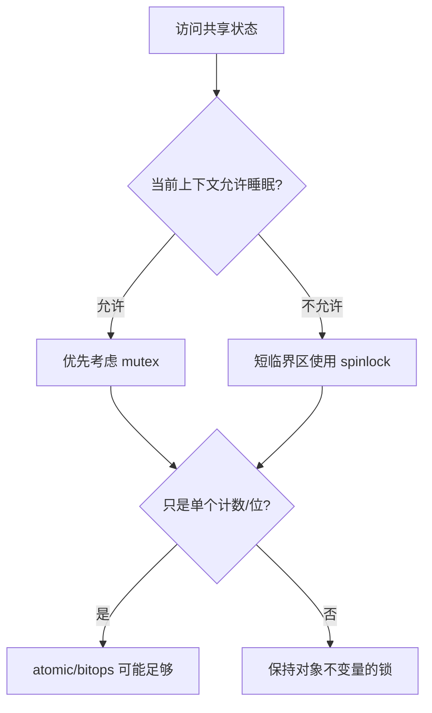

字符设备只有一个测试程序时，共享状态看起来很安全。但两个进程可以同时打开同一节点，定时器和中断也可能在任意时刻访问设备。并发问题并不是“CPU 很快”，而是多个执行流对同一状态的操作可以交错。

## 1. 一条自增语句不是一个不可分割动作

`counter++` 通常包含读取、计算和写回。两个 CPU 同时读取旧值，最终可能只增加一次。先用两个内核线程循环自增同一计数器，就能观察最终值偶尔小于预期。这个现象叫 lost update。

临界区是必须作为整体完成的代码，不是整段函数。先确定共享对象和不允许交错的不变量，再选择同步工具；“给所有函数加同一把锁”往往掩盖设计问题。

## 2. 先判断当前执行上下文能否睡眠

系统调用和工作队列通常运行在进程上下文，可以阻塞调度；硬中断、softirq 和持有 spinlock 的区域不能睡眠。选择 mutex 还是 spinlock，首先由上下文决定。



## 3. mutex 保护可睡眠的设备操作

字符设备的 read/write 在进程上下文，前文的缓冲区使用 mutex 合理：

```c
mutex_lock(&dev->lock);
ret = update_device_state(dev, command);
mutex_unlock(&dev->lock);
```

不要在持锁期间等待一个同样需要这把锁的完成事件，也不要从硬中断调用 `mutex_lock()`。锁的顺序固定后要保持一致，否则两个线程可能形成死锁。

## 4. spinlock 保护短小的不可睡眠区域

当中断处理和进程代码共享队列索引时，可以在进程侧保存中断状态：

```c
unsigned long flags;

spin_lock_irqsave(&dev->lock, flags);
value = dev->pending_events;
dev->pending_events = 0;
spin_unlock_irqrestore(&dev->lock, flags);
```

持有 spinlock 时不能调用可能睡眠的函数，例如 `copy_to_user()`、`mutex_lock()` 或阻塞式总线传输。常见做法是在锁内只移动状态和指针，锁外完成耗时操作。

## 5. atomic 和 completion 解决不同问题

`atomic_t` 适合独立计数或状态位：

```c
if (atomic_inc_return(&dev->users) == 1)
    start_hardware(dev);
```

它只保证这一项原子操作，不会自动保护与它相关的多个字段。若“计数、指针、状态”必须一起变化，仍需要锁。

`completion` 表达“一次工作是否完成”。发起者调用 `wait_for_completion_timeout()`，完成路径调用 `complete()`。它比反复轮询布尔值更清楚，但重复使用前要理解 completion 的计数语义或调用 `reinit_completion()`。

## 6. 用证据检查锁是否选对

构造两个并发读写程序，记录错误计数；启用 lockdep 的调试内核可以发现错误锁顺序和在原子上下文睡眠。`might_sleep()` 警告、`BUG: sleeping function called from invalid context` 和 lockdep 图都比“多跑几次没死机”更有价值。

本章建立了选择同步工具的依据。下一篇讨论另一类并发：代码不在当前调用中立即执行，而是由 timer 或 workqueue 在稍后回调。

## 7. 参考资料

- [Linux locking documentation](https://docs.kernel.org/locking/index.html)
- [Linux completion](https://docs.kernel.org/scheduler/completion.html)
- [野火：Linux 内核并发与竞争](https://doc.embedfire.com/linux/rk356x/driver/zh/latest/linux_driver/base_concurrency_competition.html)
