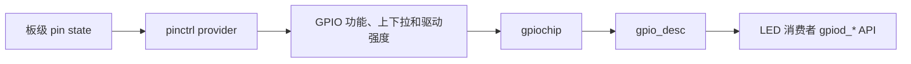

第 08 篇的 `dtled` 已经能从设备树读出一个 GPIO，但它仍把资源表示为整数编号，并由驱动自己保存 active-low flag。那种写法能说明 OF 属性如何传递，却没有说清一个物理引脚在成为 GPIO 之前还要做什么。同一个焊盘可能被复用为 UART、I2C、PWM 或 GPIO；即使选择 GPIO 功能，还会有上下拉、驱动强度和休眠时的电气状态。

Linux 把这两层分开。pinctrl 负责“这个 pin 以什么功能和电气状态出现”，GPIO 子系统负责“已经作为 GPIO 的线路处于什么逻辑值”。对消费者驱动而言，现代接口不是一个全局数字，而是 `struct gpio_desc *`。这个描述符带着设备树提供的连接关系和 active-low 语义，使驱动能够表达“打开 LED”而不是“把 GPIO 23 写成低”。

## 1. 一根 pin 经过的对象

SoC 的 pinctrl provider 驱动向 pinctrl core 注册有哪些引脚、可选功能和配置项。它在设备树里通常有一个控制器节点，板级 DTS 则定义一组命名的 pin state。消费者节点通过 `pinctrl-names` 和 `pinctrl-0` 引用该状态。GPIO controller（`gpiochip`）向 GPIO core 注册可以被逐线请求的 GPIO；一条线以 `gpio_desc` 表示。



这张图也解释了常见故障的归属。驱动成功取得描述符却没有电平变化，原因可能是 pin mux 还处于 UART 功能，或者外部电路的上下拉和有效电平理解错误；反过来，pinctrl state 存在而 GPIO 请求失败，可能是另一消费者已经占用了线路。直接写 SoC GPIO 寄存器会跳过这些对象，短期似乎能点亮 LED，长期却会使 pinmux、所有权和休眠配置难以追踪。

## 2. pinctrl 状态由谁选择

### 2.1 `default` 和 `sleep` 是消费者的意图

一个设备节点常见下面两个名字：`default` 表示设备正常工作时选择的状态，`sleep` 表示进入系统休眠时的低功耗或安全状态。名字是消费者约定，具体的 mux 与电气参数由被引用的 pinctrl group 定义：

```dts
dtled: dtled {
    compatible = "eeandedgeai,dtled";
    pinctrl-names = "default", "sleep";
    pinctrl-0 = <&dtled_default_pins>;
    pinctrl-1 = <&dtled_sleep_pins>;
    led-gpios = <&gpio_controller gpio_offset GPIO_ACTIVE_LOW>;
    status = "okay";
};
```

`dtled_default_pins`、`dtled_sleep_pins`、`gpio_controller` 和 `gpio_offset` 都是需要从当前 RV1126 SDK 的 pinctrl DTSI、板级 DTS 与原理图核对的引用，并不是可直接应用的名称或数值。Rockchip 不同内核分支的 pinctrl 宏、group 命名和电气配置写法会不同；本章不把其他开发板的 bank/port/pin 复制成 RV1126 的“示例值”。

实操时，先在当前板级 DTS 搜索已经工作的 LED、按键或外设节点，并一路追到其 `pinctrl-0` 引用的 group 与 GPIO provider：

```sh
rg -n 'pinctrl-names|pinctrl-0|gpios|gpio.*pins' arch/arm/boot/dts
rg -n 'gpio-leds|led-gpios|default.*pins' arch/arm/boot/dts
```

命令的目录是典型 32 位 ARM 内核布局；若 SDK 使用其他 `arch/*/boot/dts` 路径，应按其 Kbuild 目录调整。找到的现有配置不应直接与本实验共享同一条线：可复制它的已证实 pinmux 形式，但要为实验 LED 选择原理图上确实空闲的引脚，或先停用原有 LED 消费者。

### 2.2 provider 与 consumer 不替对方做决定

pinctrl provider 知道如何写寄存器，却不知道哪一个上层设备在何时需要某个功能。consumer 知道“本设备工作时要 GPIO、休眠时要安全电平”，却不需要知道寄存器地址。`devm_pinctrl_get_select_default()` 正是 consumer 在 `probe()` 中取得并选择 `default` 状态的便利 API。系统级 suspend/resume 的状态切换还取决于设备的 PM 路径；定义了 `sleep` 不等于任意外部模块都会自动完整处理所有电源状态，实际行为需结合该内核的驱动和 PM 配置观察。

## 3. GPIO descriptor 不再让消费者关心全局编号

第 08 篇使用 `of_get_named_gpio_flags()` 得到整数 GPIO，再把 `OF_GPIO_ACTIVE_LOW` 保存到私有结构。descriptor API 把这两步收敛为 `devm_gpiod_get()`：它从 `pdev->dev.of_node` 查找名字为 `led` 的 GPIO，因此对应属性是 `led-gpios`；它返回绑定该设备的 `struct gpio_desc *`；active-low flag 则在读写函数内部转换。

```c
led = devm_gpiod_get(&pdev->dev, "led", GPIOD_OUT_LOW);
if (IS_ERR(led))
    return dev_err_probe(&pdev->dev, PTR_ERR(led),
                         "cannot get led GPIO\n");

gpiod_set_value_cansleep(led, 1); /* 逻辑上点亮 */
gpiod_set_value_cansleep(led, 0); /* 逻辑上熄灭 */
```

若 DTS 标记 `GPIO_ACTIVE_LOW`，逻辑值 1 会被 framework 转成实际低电平；高有效 LED 则转成实际高电平。驱动不再需要 `if (active_low)` 分支，用户接口也不必知道电路接法。`_cansleep` 版本可以支持 GPIO 扩展器等可能睡眠的 controller，因此本例在 sysfs 进程上下文中使用它；它不能放进第 09 篇所说的硬中断顶半部。

`devm_` 前缀使描述符在 `pdev->dev` 解绑时自动释放。它并不会解决另一个驱动已经占用 GPIO 的问题，反而会把这个所有权冲突明确地报告为 `probe()` 错误，这正是设备资源管理应有的行为。

## 4. 用 descriptor 重建 LED 驱动

### 4.1 完整的消费者部分

下面代码替换第 08 篇 `dtled.c`。仍保留 `state` sysfs 属性，便于把两版驱动的用户观察对照起来；差别集中在 `probe()` 如何选择 pinctrl、取得 `gpio_desc`，以及读写怎样保持逻辑语义。

```c
#include <linux/gpio/consumer.h>
#include <linux/module.h>
#include <linux/mutex.h>
#include <linux/pinctrl/consumer.h>
#include <linux/platform_device.h>

struct descled {
    struct gpio_desc *led;
    struct mutex lock;
};

static ssize_t state_show(struct device *dev,
                          struct device_attribute *attr, char *buf)
{
    struct descled *led = dev_get_drvdata(dev);
    int value;

    mutex_lock(&led->lock);
    value = gpiod_get_value_cansleep(led->led);
    mutex_unlock(&led->lock);
    if (value < 0)
        return value;

    return sysfs_emit(buf, "%d\n", value);
}

static ssize_t state_store(struct device *dev,
                           struct device_attribute *attr,
                           const char *buf, size_t count)
{
    struct descled *led = dev_get_drvdata(dev);
    bool on;
    int ret;

    ret = kstrtobool(buf, &on);
    if (ret)
        return ret;

    mutex_lock(&led->lock);
    gpiod_set_value_cansleep(led->led, on);
    mutex_unlock(&led->lock);
    return count;
}
static DEVICE_ATTR_RW(state);

static struct attribute *descled_attrs[] = {
    &dev_attr_state.attr,
    NULL,
};
static const struct attribute_group descled_group = {
    .attrs = descled_attrs,
};

static int descled_probe(struct platform_device *pdev)
{
    struct descled *led;
    struct pinctrl *pinctrl;
    int ret;

    pinctrl = devm_pinctrl_get_select_default(&pdev->dev);
    if (IS_ERR(pinctrl))
        return dev_err_probe(&pdev->dev, PTR_ERR(pinctrl),
                             "cannot select default pins\n");

    led = devm_kzalloc(&pdev->dev, sizeof(*led), GFP_KERNEL);
    if (!led)
        return -ENOMEM;
    mutex_init(&led->lock);

    led->led = devm_gpiod_get(&pdev->dev, "led", GPIOD_OUT_LOW);
    if (IS_ERR(led->led))
        return dev_err_probe(&pdev->dev, PTR_ERR(led->led),
                             "cannot get led GPIO\n");

    platform_set_drvdata(pdev, led);
    ret = devm_device_add_group(&pdev->dev, &descled_group);
    if (ret)
        return ret;

    dev_info(&pdev->dev, "descriptor LED ready\n");
    return 0;
}

static const struct of_device_id descled_of_match[] = {
    { .compatible = "eeandedgeai,dtled" },
    { }
};
MODULE_DEVICE_TABLE(of, descled_of_match);

static struct platform_driver descled_driver = {
    .probe = descled_probe,
    .driver = {
        .name = "dtled",
        .of_match_table = descled_of_match,
    },
};
module_platform_driver(descled_driver);
MODULE_LICENSE("GPL");
MODULE_DESCRIPTION("Pinctrl and GPIO descriptor LED teaching driver");
```

`GPIOD_OUT_LOW` 的“low”是消费者看到的逻辑值，所以它初始化为“LED 关闭”。`gpiod_get_value_cansleep()` 返回的也已经是逻辑值；sysfs 中 `1` 始终表示用户请求点亮，即使万用表在实际引脚上测到的是低电平。互斥锁不服务于 GPIO descriptor 本身，而是保护这次读写和后续扩展的共享 LED 状态。若未来有 IRQ 同时更新状态，应采用第 09 篇的短 spinlock 加工作队列结构，不能把这把 mutex 带进硬中断。

### 4.2 构建和板端观察

把第 08 篇的模块源码换成上述版本、保留相同 `Kbuild`，然后用匹配运行内核的构建目录编译：

```sh
make -C "$KERNEL_BUILD" M="$PWD" \
  ARCH=arm CROSS_COMPILE="$CROSS_COMPILE" modules
```

确认启动 DTB 包含已核实的 `pinctrl-0` 和 `led-gpios` 后重启，再加载模块：

```sh
sudo insmod ./dtled.ko
dmesg | tail -n 30
find /sys/bus/platform/devices -type f -name state -print
```

找到 `state` 后写入逻辑值并读取：

```sh
STATE=/sys/bus/platform/devices/dtled/state  # 替换为 find 的实际结果
printf '1\n' | sudo tee "$STATE"
cat "$STATE"
printf '0\n' | sudo tee "$STATE"
```

若 `probe` 日志显示 `cannot select default pins`，先检查正在运行的 DTB 是否真包含引用的 pinctrl state，以及 provider 驱动是否启用；若显示 `cannot get led GPIO`，检查 `led-gpios` 属性的名字、GPIO provider 和是否已被占用。观察的顺序很重要：先验证设备树和匹配，再判断 GPIO 控制，避免把 pinmux 问题误认为“descriptor API 不工作”。本章没有在任何 RV1126 板上执行这些命令，输出应以你的串口日志和运行树为准。

## 5. 为中断输入留下相同的资源表达

descriptor 的另一个收益会在下一篇立即出现。一个按键的 `key-gpios` 可以同样由 `devm_gpiod_get()` 获取；驱动随后通过 `gpiod_to_irq()` 取得与该线关联的中断，而不必假定 GPIO 号与 Linux IRQ 号相同。pinctrl 的 `default` 状态可把 pin 配成输入并设置偏置，GPIO consumer 则读取逻辑按下/释放，active-low 仍由设备树 flag 处理。

因此，pinctrl 和 GPIO descriptor 不是给简单 LED 增加的仪式，而是在设备树、平台驱动、延迟工作和中断之间保留同一种资源语言。下一篇将沿着这条输入线路进入中断系统：从 GIC 和 `irq_domain` 如何把硬件中断映射为 Linux IRQ 开始，再看顶半部、线程化中断和设备资源管理怎样配合。

## 6. 参考资料

- Linux Kernel Documentation, [Pin Control subsystem](https://docs.kernel.org/6.12/driver-api/pin-control.html) 与 [GPIO Descriptor Consumer Interface](https://docs.kernel.org/6.12/driver-api/gpio/consumer.html)。
- Linux kernel stable source, [include/linux/gpio/consumer.h (v6.12)](https://git.kernel.org/pub/scm/linux/kernel/git/stable/linux.git/tree/include/linux/gpio/consumer.h?h=v6.12)、[drivers/gpio/gpiolib.c (v6.12)](https://git.kernel.org/pub/scm/linux/kernel/git/stable/linux.git/tree/drivers/gpio/gpiolib.c?h=v6.12)、[drivers/pinctrl/core.c (v6.12)](https://git.kernel.org/pub/scm/linux/kernel/git/stable/linux.git/tree/drivers/pinctrl/core.c?h=v6.12) 与 [include/dt-bindings/gpio/gpio.h (v6.12)](https://git.kernel.org/pub/scm/linux/kernel/git/stable/linux.git/tree/include/dt-bindings/gpio/gpio.h?h=v6.12)。
- Devicetree Specification, [Version 0.4](https://github.com/devicetree-org/devicetree-specification/releases/download/v0.4/devicetree-specification-v0.4.pdf)，用于 GPIO phandle/cell 的基础语义。
- EmbedFire, [Linux 内核 Pinctrl 子系统与 GPIO 子系统](https://doc.embedfire.com/linux/rk356x/driver/zh/latest/linux_driver/subsystem_pinctrl_gpio.html)，用于课程实验对照；本文的消费者 API 和 active-low 语义以 Linux 6.12 文档和源码为准。
