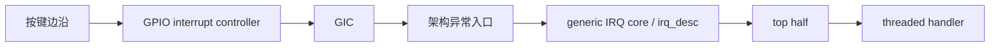

轮询按键会不断读取 GPIO，即使电平没有变化也占用 CPU。中断把方向反过来：硬件状态变化时主动通知处理器，驱动只在事件发生后运行。要正确使用 `request_threaded_irq()`，先要理解硬件中断号为何会变成 Linux IRQ。

## 1. 一次 GPIO 边沿经过哪些层

按键产生电平边沿，GPIO 控制器记录 pending 位并向 GIC 发出中断；GIC 决定目标 CPU 和优先级；架构入口进入通用 IRQ 核心；`irq_desc` 再调用该 IRQ 上注册的 action。



驱动通常不操作 GIC 寄存器。irqchip 驱动已经负责 mask、ack、eoi 和层级转发，consumer 只取得 Linux IRQ 并注册处理函数。

## 2. irq_domain 负责号码翻译

设备树中的硬件中断描述属于某个 interrupt-controller。`irq_domain` 把 provider 的硬件号映射成 Linux 内部 IRQ。GPIO 中断常是层级结构：设备引用 GPIO 控制器的某个 pin，GPIO irq_domain 再连接到 GIC domain。

```dts
button {
    button-gpios = <&gpio2 RK_PA1 GPIO_ACTIVE_LOW>;
    interrupt-parent = <&gpio2>;
    interrupts = <RK_PA1 IRQ_TYPE_EDGE_FALLING>;
};
```

驱动优先使用 `platform_get_irq()` 或 `gpiod_to_irq()`，不要把 DTS 中看到的硬件号直接传给 `request_irq()`。

## 3. 顶半部只确认并交接事件

```c
static irqreturn_t button_irq(int irq, void *data)
{
    struct button_dev *button = data;

    button->irq_timestamp = ktime_get();
    return IRQ_WAKE_THREAD;
}

static irqreturn_t button_thread(int irq, void *data)
{
    struct button_dev *button = data;
    int pressed = gpiod_get_value_cansleep(button->gpiod) == 0;

    button_publish_event(button, pressed);
    return IRQ_HANDLED;
}
```

硬中断上下文不能睡眠，顶半部只保存最少状态并唤醒线程。线程化 handler 运行在可调度上下文，可以读取会睡眠的 GPIO controller 或执行较慢处理。若硬件没有需要立即 ack 的私有寄存器，也可传入 NULL 顶半部并使用 `IRQF_ONESHOT` 让核心管理屏蔽。

## 4. 在 probe 中取得并注册 IRQ

```c
button->gpiod = devm_gpiod_get(dev, "button", GPIOD_IN);
if (IS_ERR(button->gpiod))
    return dev_err_probe(dev, PTR_ERR(button->gpiod),
                         "failed to get button\n");

button->irq = gpiod_to_irq(button->gpiod);
if (button->irq < 0)
    return button->irq;

ret = devm_request_threaded_irq(dev, button->irq,
                                button_irq, button_thread,
                                IRQF_TRIGGER_FALLING | IRQF_ONESHOT,
                                dev_name(dev), button);
```

触发类型应来自电路和 binding。按键抖动会产生多次边沿，它不是 IRQ core 故障；可以用硬件 debounce、GPIO debounce 或 delayed_work 在稍后确认稳定电平。

## 5. 用计数和时间戳验证路径

```sh
cat /proc/interrupts
dmesg -w
grep -i gpio /sys/kernel/debug/irq/irqs/* 2>/dev/null
```

按键前后比较 `/proc/interrupts` 对应行，确认计数增长和 CPU 分布；驱动日志记录 sequence 与时间戳，判断抖动还是事件丢失。卸载前停止新事件并同步取消去抖工作。

下一篇把中断产生的事件交给用户程序，比较阻塞 read、非阻塞、poll/epoll 和 SIGIO 如何等待同一份状态。

## 6. 参考资料

- [Linux Generic IRQ](https://docs.kernel.org/core-api/genericirq.html)
- [IRQ domain](https://docs.kernel.org/core-api/irq/irq-domain.html)
- [野火：Linux 中断子系统](https://doc.embedfire.com/linux/rk356x/driver/zh/latest/linux_driver/subsystem_interrupt.html)
- [野火：Linux 中断分层](https://doc.embedfire.com/linux/rk356x/driver/zh/latest/linux_driver/subsystem_interrupt_layering.html)
