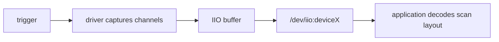

ADC 输出的是量化码，应用需要知道通道、分辨率和参考电压才能换算。IIO 为 ADC、加速度计、陀螺仪等采样设备提供统一 channel、属性和 buffer 模型。

## 1. channel 描述一种可测量量

`struct iio_chan_spec` 指定类型、索引、scan_index 和支持的 info：

```c
static const struct iio_chan_spec demo_channels[] = {
    {
        .type = IIO_VOLTAGE,
        .indexed = 1,
        .channel = 0,
        .info_mask_separate = BIT(IIO_CHAN_INFO_RAW),
        .info_mask_shared_by_type = BIT(IIO_CHAN_INFO_SCALE),
    },
};
```

驱动的 `read_raw` 根据 mask 返回 raw 或 scale。IIO 使用返回类型说明整数、分数或微单位，不能把毫伏直接伪装成原始码。

## 2. sysfs 先验证单次采样

```sh
find /sys/bus/iio/devices -maxdepth 2 -type f
cat /sys/bus/iio/devices/iio:deviceX/in_voltage0_raw
cat /sys/bus/iio/devices/iio:deviceX/in_voltage_scale
```

电压通常按 `raw × scale` 计算，但 scale 单位和格式要看驱动输出。先接已知电压并核对范围，避免超过 ADC 输入额定值。

## 3. buffer 适合连续采样

高频采样不应反复打开 sysfs。IIO buffer 用 scan mask 定义每帧通道布局，trigger 决定何时采样，用户从 `/dev/iio:deviceX` 读取二进制帧。



启用 buffer 前先配置 scan_elements 和长度；数据字节序、有效位和存储位来自 `*_type` 属性。若当前 RV1126 ADC 驱动只支持 direct mode，就只做 sysfs 实验，不假设存在 triggered buffer。

## 4. ADC 驱动仍依赖硬件时序

probe 获取 clock、reset、regulator、IRQ，并注册 iio_dev。采样完成可能由轮询或中断通知。runtime PM 在读取前恢复 ADC，结束后允许 autosuspend。

用万用表、raw/scale 与实际电压做多点对照，可以区分换算错误、参考电压错误和硬件噪声。下一篇处理另一类低速数据：RTC 时间以及 NVMEM 中的板级身份和校准值。

## 5. read_raw 把硬件码交给 IIO 语义

```c
static int demo_read_raw(struct iio_dev *indio_dev,
                         const struct iio_chan_spec *chan,
                         int *val, int *val2, long mask)
{
    switch (mask) {
    case IIO_CHAN_INFO_RAW:
        *val = demo_adc_convert(iio_priv(indio_dev), chan->channel);
        return *val < 0 ? *val : IIO_VAL_INT;
    case IIO_CHAN_INFO_SCALE:
        *val = 1800;
        *val2 = 12;
        return IIO_VAL_FRACTIONAL_LOG2;
    default:
        return -EINVAL;
    }
}
```

上例表示参考电压 1800 mV、12 位量化，实际参数必须来自 regulator 和 ADC driver。若参考电压可变，scale 不能写死。一次转换还要处理 busy、timeout 和 runtime PM，返回负错误码而不是旧样本。

## 6. triggered buffer 如何形成连续帧

trigger 到达后 pollfunc 读取启用通道，按 scan_index 排列数据，并附加 timestamp：

```c
iio_push_to_buffers_with_timestamp(indio_dev, sample,
                                   iio_get_time_ns(indio_dev));
```

用户空间先启用 `scan_elements/in_voltage0_en`、设置 buffer length，再 enable。读取二进制数据时根据 `in_voltage0_type` 解析 endian、signedness、realbits、storagebits 和 shift。不能把 buffer 当作简单的连续 `int` 数组。

实验同时保存 raw、scale、换算电压、万用表值和采样标准差。偏移恒定可能来自校准，随机抖动可能来自电源/参考噪声，周期性干扰则需要结合采样率和板级时钟分析。

## 7. 参考资料

- [Industrial I/O](https://docs.kernel.org/driver-api/iio/index.html)
- [IIO userspace ABI](https://docs.kernel.org/admin-guide/abi-testing.html)
- [野火：IIO 子系统](https://doc.embedfire.com/linux/rk356x/driver/zh/latest/linux_driver/subsystem_iio_subsystem.html)
- [野火：ADC 驱动](https://doc.embedfire.com/linux/rk356x/driver/zh/latest/linux_driver/subsystem_adc_driver.html)
