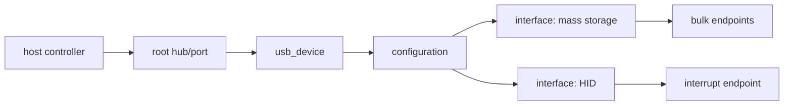

上一章的 U 盘最终表现为 SCSI 块设备，但在此之前，USB host 必须发现设备、读取 descriptor、选择 configuration，并为每个 interface 绑定 class driver。USB 子系统的核心不是某个 `/dev` 节点，而是枚举后形成的对象层次。

## 1. host controller 和 root hub 提供总线

xHCI/EHCI/OHCI 等 HCD 管理 controller、端口和 DMA，并向 USB core 注册 `usb_bus`。root hub 代表控制器自身端口，外部 hub 再扩展拓扑。`lsusb -t` 显示的树就是这套连接关系。

## 2. device、configuration、interface、endpoint

device descriptor 给出 VID/PID 和配置数量；configuration 包含 interface；interface 可以有 alternate setting；endpoint 说明控制、bulk、interrupt 或 isochronous 传输方向和包大小。

driver 通常匹配 `usb_interface`，不是独占整个 device。一个复合设备的存储、串口和音频 interface 可以分别绑定不同驱动。



## 3. 枚举按明确顺序发生

设备 attach 后，host reset 端口、分配地址、读取 descriptor、选择 configuration，USB core 才创建 interface device 并进行 driver match。`dmesg -w` 和 `usbmon` 能判断失败停在连接、descriptor 还是 class driver。

```sh
lsusb
lsusb -t
lsusb -v -d <vid:pid>
readlink -f /sys/bus/usb/devices/1-1:1.0/driver
```

## 4. URB 描述一次异步传输

USB Request Block 保存 endpoint pipe、buffer、长度、完成回调和状态：

```c
usb_fill_bulk_urb(urb, udev, usb_rcvbulkpipe(udev, ep),
                  buffer, size, complete, context);
ret = usb_submit_urb(urb, GFP_KERNEL);
```

提交成功只表示 URB 进入 HCD，完成结果在 callback 的 `urb->status` 和 `actual_length`。断开时要阻止新提交并用 usb anchor/kill 接口等待在途 URB，避免 callback 访问已释放对象。

## 5. gadget 是设备侧模型

当 Linux 板卡作为 USB peripheral 时，UDC driver 提供 endpoint，gadget function 实现 ACM、ECM、mass-storage 等协议，configfs 组合 configuration。host 和 gadget 角色的 VBUS、枚举责任不同。

本篇只建立地图。descriptor、URB、class driver、gadget 和 MCU CherryUSB 的完整实战在站内 USB 专题继续展开。

下一篇回到 SoC 内部串口，理解 UART controller 怎样经过 serial_core 和 TTY 变成终端。

## 6. 一个 interface driver 的生命周期

USB driver 的 ID 表可以按 VID/PID 或 interface class 匹配。probe 收到 `usb_interface`，通过 `interface_to_usbdev()` 取得 device，并从当前 alternate setting 查找 endpoint：

```c
static const struct usb_device_id demo_ids[] = {
    { USB_DEVICE(0x1234, 0x5678) },
    { }
};
MODULE_DEVICE_TABLE(usb, demo_ids);

static struct usb_driver demo_driver = {
    .name = "demo-usb",
    .probe = demo_probe,
    .disconnect = demo_disconnect,
    .id_table = demo_ids,
};
module_usb_driver(demo_driver);
```

probe 为 endpoint 分配 buffer/URB 并用 `usb_set_intfdata()` 保存实例；disconnect 先清空 intfdata、阻止新 I/O、kill anchored URB，再等待打开者和 callback 退出。USB 线可以在任意时刻拔出，因此 disconnect 不是仅在模块卸载时发生。

用 `usbmon` 观察 control descriptor、bulk/interrupt transfer 和错误码，可以把“设备反复断开”区分为供电/PHY/协议/driver 生命周期问题。autosuspend 还要求 driver 提供 suspend/resume 或使用 core 支持，恢复后要重新验证传输。

## 7. 参考资料

- [Linux USB API](https://docs.kernel.org/driver-api/usb/index.html)
- [USB Host Side API](https://docs.kernel.org/driver-api/usb/usb.html)
- [USB Gadget](https://docs.kernel.org/driver-api/usb/gadget.html)
- [野火：USB 子系统](https://doc.embedfire.com/linux/rk356x/driver/zh/latest/linux_driver/subsystem_usb_subsystem.html)
